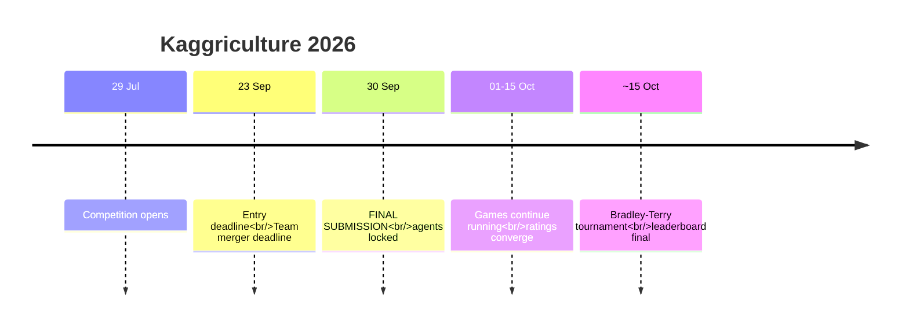
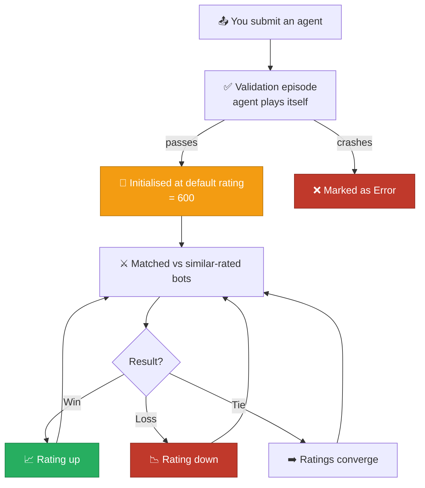
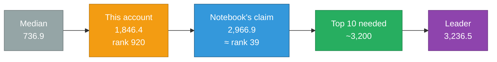

[← Index](README.md) | **01 — Competition Overview** | [Next: Game Rules →](02-game-rules.md)

---

# 01 — Competition Overview


---

## 🎮 What kind of competition is this?

> [!IMPORTANT]
> **Kaggriculture is not a machine-learning competition.** There is no training data, no
> test set, no CSV to submit, and no metric to optimise. You write a **program** that plays
> a game, and it competes head-to-head against other people's programs.

If you have done ordinary Kaggle competitions before, essentially none of that workflow
applies here. There is nothing to fit. Success comes from understanding the game's
economics and writing good decision logic.

| Ordinary Kaggle competition | Kaggriculture |
|---|---|
| Download `train.csv` / `test.csv` | No data at all |
| Train a model | Write a decision-making program |
| Submit predictions | Submit an agent (`submission.py`) |
| Scored against ground truth | Scored by winning games against other players |
| Score is stable | Score drifts continuously as games are played |
| You compete against a metric | You compete against **live opponents** |

This genre is sometimes called a "simulation competition" or "agent competition". Past
Kaggle examples include Halite, Lux AI, and Kore.

---

## 📅 Timeline



| Date | Event |
|---|---|
| **29 July 2026** | Start date |
| **23 September 2026** | Entry deadline — you must accept the rules by this date |
| **23 September 2026** | Team merger deadline |
| **30 September 2026** | ⚠️ **Final submission deadline** |
| **1–15 October 2026** | Games keep running to reduce rating uncertainty |
| **~15 October 2026** | Final Bradley-Terry tournament produces the final leaderboard |

All deadlines are 23:59 UTC.

---

## 💰 Prizes

> [!TIP]
> **Places 1 through 10 each win $5,000.** There is no extra reward for finishing 1st over
> 10th. This should shape your entire strategy: optimise for a *reliable* top-10 finish,
> not for a risky shot at the top.

| Place | Prize |
|---|---|
| 1st – 10th | **$5,000 each** |

Total pool: $50,000.

---

## 🏅 How scoring actually works

This is the part most people misunderstand, so it's worth being precise.

### Skill rating, not points

Each submission is assigned a **skill rating**, conceptually like a chess Elo:



### 🔑 The five rules that matter

> [!NOTE]
> **1. New submissions start at 600.**
> That is a default initialisation value, *not* a score your agent earned. Seeing 600
> immediately after submitting is completely normal and is not a regression.

> [!NOTE]
> **2. Only win/loss/tie matters — margin is irrelevant.**
> Winning by $1 and winning by $100,000 produce the exact same rating change. This is a
> crucial strategic fact: do not optimise for money, optimise for *beating the opponent*.

> [!NOTE]
> **3. Beating a strong opponent is worth more.**
> Rating change scales with the gap between you and your opponent.

> [!WARNING]
> **4. Only your latest 2 submissions are tracked.**
> Older submissions stop playing and are excluded from final evaluation. Submitting
> carelessly can push a good agent out of the tracked window.

> [!NOTE]
> **5. Up to 5 submissions per day.** Only your best bot is shown on the leaderboard, but
> all are visible on your Submissions page.

### Why ratings take time

A brand-new agent has high rating *uncertainty*, so early games move it in large steps —
600 → 1,800 in a dozen games is normal. As uncertainty falls, moves get smaller and the
rating settles near the agent's true strength. This is why the competition keeps running
games for two weeks after the deadline.

---

## 🎯 What this means strategically

| Because… | You should… |
|---|---|
| Margin doesn't matter | Optimise win *rate*, not final money |
| Top 10 all pay the same | Prefer reliability over variance |
| Only latest 2 count | Never submit casually — each upload costs you a tracked slot |
| Ratings drift for weeks | Submit good agents *early* so they have time to converge |
| Validation is self-play | Your agent must not crash against itself |

> [!TIP]
> **Practical rule:** don't submit unless you have something genuinely different to test.
> Re-submitting an identical agent resets it to 600 and wastes one of your two tracked
> slots for no benefit.

---

## 📊 Competitive landscape

Measured 13 August 2026:

| Metric | Value |
|---|---|
| Teams on leaderboard | **4,283** |
| Top score | 3,236.5 |
| Teams above 3,000 | **28** |
| Median score | 736.9 |
| Score needed for top 10 | **~3,200** |



> [!IMPORTANT]
> The gap between rank 39 and rank 10 is small in rating terms but represents a large gap
> in agent quality — 28 teams are packed between 3,000 and 3,236. See
> [12 — Roadmap](12-roadmap.md) for what would be required.

---

## 📤 Submission mechanics

| Requirement | Detail |
|---|---|
| Single file | Must be named **`submission.py`** |
| Multi-file bundle | Must be named **`submission.tar.gz`** with `main.py` at root |
| Entry point | A function named `agent(obs)` |
| Validation | Automatic self-play episode on upload |

```bash
# single file
kaggle competitions submit kaggriculture -f submission.py -m "description"

# bundle
tar -czf submission.tar.gz main.py helper.py
kaggle competitions submit kaggriculture -f submission.tar.gz -m "description"
```

Useful monitoring commands:

```bash
kaggle competitions submissions kaggriculture        # your submissions + scores
kaggle competitions episodes <SUBMISSION_ID>         # games played
kaggle competitions leaderboard kaggriculture -s     # top of leaderboard
kaggle competitions logs <EPISODE_ID> 0              # debug a crash
```

---

[← Index](README.md) | **01 — Competition Overview** | [Next: Game Rules →](02-game-rules.md)
