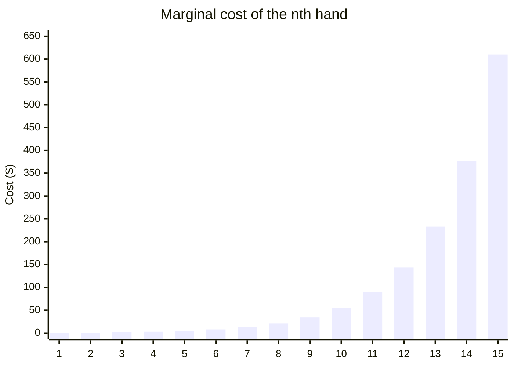
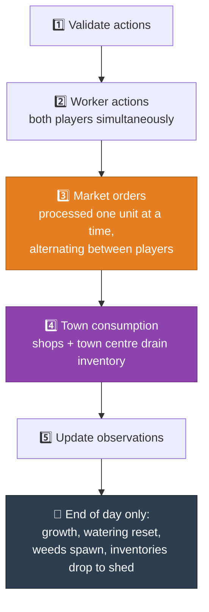

[← 01 Competition](01-competition-overview.md) | **02 — Game Rules Reference** | [Next: Market Economics →](03-market-economics.md)

---

# 02 — Game Rules Reference


A complete mechanics reference. Everything here is drawn from the official `README.md` and
verified against the engine source (`kaggriculture.py`) where it mattered.

---

## 🗺️ The board

Each player has their **own** 10×10 grid, split into four 5×5 quadrants.

```
        x=0 ....... x=4 │ x=5 ....... x=9
      ┌─────────────────┼─────────────────┐
  y=0 │                 │                 │
   .  │   NW  (owned    │   NE            │
   .  │       at start) │   $1,000        │
  y=4 │                 │                 │
      ├────────────█────┼────────────────-┤
  y=5 │            SHED │                 │
   .  │   SW            │   SE            │
   .  │   $2,000        │   $4,000        │
  y=9 │                 │                 │
      └─────────────────┴─────────────────┘
```

| Rule | Detail |
|---|---|
| Starting territory | **NW quadrant only** (25 of 100 tiles) |
| Unlock cost | $1,000 → $2,000 → $4,000 (increasing) |
| Locked tiles | **Passable** — you can walk across them, but tile actions do nothing |
| Tile contents | empty, plant, weed, coop, pasture, or `"LOCKED"` |
| Weeds | Spawn on empty tiles at 0.5%/tile/day; must be `DIG`-ed out |

> [!NOTE]
> You can see your opponent's **farm** but not their **shed**. Their production is public;
> their stockpile is not.

### The shed

Sits at the centre and is **not a tile** — it never appears in the tile array. You interact
with it by standing on one of the four centre tiles: `(4,4)`, `(5,4)`, `(4,5)`, `(5,5)`.

> [!CAUTION]
> **Shed capacity is 100 non-seed items. Anything over that at end of day is destroyed** —
> there is no overflow area. This bites harder than it sounds; see
> [08 — Experiments](08-experiments.md#v19--no-op-salvage) for a variant that failed
> partly because of it.

---

## 👷 Workers and actions

> [!IMPORTANT]
> **The real currency of this game is actions, not money.** Each worker gets exactly one
> action per turn. Every strategic question ultimately reduces to "what is the best use of
> this action?"

| | |
|---|---|
| Main farmer | 1, permanent, 720 actions per season |
| Farm hands | Hired daily, vanish at end of day |
| Turns per day | 24 |
| Actions per worker per turn | 1 |

### 💸 Hiring cost — the Fibonacci wall

The nth hand hired **within a single day** costs `fib(n)`, and the counter resets daily:

| Hand # | 1 | 2 | 3 | 4 | 5 | 6 | 7 | 8 | 9 | 10 | 11 | 12 | 13 | 14 | 15 |
|---|---|---|---|---|---|---|---|---|---|---|---|---|---|---|---|
| Cost | 1 | 1 | 2 | 3 | 5 | 8 | 13 | 21 | 34 | 55 | **89** | **144** | **233** | **377** | **610** |
| Cumulative | 1 | 2 | 4 | 7 | 12 | 20 | 33 | 54 | 88 | **143** | **232** | **376** | **609** | **986** | **1,596** |



> [!WARNING]
> The first ten hands cost **$143 total**. The next four cost **$843**. This wall is the
> reason "just hire more workers" doesn't work — see
> [09 — Dead Ends](09-dead-ends.md#the-se-quadrant-expansion).

Hands spawn beside the shed and **drop their inventory into the shed at end of day** (if
there's room).

---

## 🌱 Crops

| Crop | Seed | Base price | First yield | Max yield day | Max units | Repeating? |
|---|---|---|---|---|---|---|
| 🌾 Wheat | $10 | $25 | day 2 | day 4 | 6 (4 unfertilized) | no |
| 🥕 Carrot | $20 | $35 | day 2 | day 3 | 4 (3 unfertilized) | no |
| 🍅 Tomato | $50 | $60 | day 8 | day 11 | 4 | yes, daily ×4 |
| 🍓 Strawberry | $100 | $120 | day 10 | day 16 | 4 | yes, alternate days ×4 |
| 🍈 Melon | $80 | $250 | day 10 | day 10 | 6 | no |

### Watering rules

> [!CAUTION]
> **Plants must be watered every day.** Two consecutive missed days turns the plant into a
> weed. A freshly planted seed starts at `consecutive_unwatered = 1`, so **planting and not
> watering the same day kills it that night**. There is no grace period.

For **one-time crops** (wheat, carrot, melon), watering during the bonus window — which
starts at `ceil(max_yield_day / 2)` — adds **+1 unit per watered day**. Fertilizer doubles
that to +2 for three days.

For **repeating crops** (tomato, strawberry), scheduled production is 1 unit; being both
fertilized *and* watered that day doubles it to 2.

### Decay

Once past maximum lifespan, yield drops by 1 every other turn until zero, then the tile
becomes a weed.

---

## 🐄 Animals

| Animal | Cost | Produces | Base price | First yield | Then | Max held |
|---|---|---|---|---|---|---|
| 🦆 Goose | $300 | Egg | $50 | day 4 | **every day, forever** | 4 |
| 🐄 Cow | $400 | Milk | $160 | day 8 | every 2 days, forever | 6 |
| 🐑 Sheep | $500 | Wool | $200 | day 6 | every 3 days, forever | 6 |

Each requires a structure first: `BUILD_COOP` for geese, `BUILD_PASTURE` for cows/sheep.

> [!IMPORTANT]
> **Animals produce indefinitely as long as they're fed.** `max_held` caps *unharvested*
> product sitting on the tile, not lifetime output. This makes animals fundamentally
> different from crops, which have finite lifespans.

### Feeding

> [!CAUTION]
> **Animals eat 1 wheat per day.** Two consecutive unfed days and the animal **escapes
> permanently** — you lose the entire capital investment. Feed comes from the *worker's
> inventory*, not directly from the shed, so a worker must `PICKUP` wheat first.

### Care and fertilizer

| Action | Effect |
|---|---|
| `CARE` | If fed **and** cared that day, banks +1 bonus. Paid out in full on the next production |
| `COLLECT_FERTILIZER` | Every surviving animal makes 1 fertilizer available per day, **fed or not**. Does not accumulate |

> [!TIP]
> **Animals are action-efficient in a way crops are not.** A worker standing on one
> occupied pasture can do `FEED`, `CARE`, `HARVEST`, and `COLLECT_FERTILIZER` — four
> productive actions with **zero movement**. Every crop tile costs a move per watering.
> This is the single most important tactical fact in the game; see
> [12 — Roadmap](12-roadmap.md).

---

## 🎬 Action reference

### Worker actions (one per worker per turn)

| Category | Actions |
|---|---|
| **Movement** | `NORTH` `SOUTH` `EAST` `WEST` `PASS` |
| **Shed** | `PICKUP <item> [n]` `DROP` `PLACE <item> [n]` |
| **Plants** | `PLANT <crop>` `WATER` `HARVEST` `FERTILIZE` |
| **Animals** | `BUILD_COOP` `BUILD_PASTURE` `FEED` `HARVEST` `CARE` `COLLECT_FERTILIZER` |
| **Terrain** | `DIG` |

### Market actions (up to 10 per turn, **extras silently dropped**)

| Action | Notes |
|---|---|
| `BUY_SEED <crop> <n>` | Fixed price, unlimited supply |
| `BUY_ANIMAL <animal> <n>` | Fixed price, unlimited supply |
| `BUY_PRODUCT <item> <n>` | ⚠️ **Only `WHEAT` and `FERTILIZER` can be bought back** |
| `SELL <item> <n>` | Any product; price is dynamic |
| `HIRE` | Fibonacci cost |
| `BUY_LAND` | $1,000 / $2,000 / $4,000 |

> [!WARNING]
> **Market orders execute in list order and stop when money runs out.** If an early order
> drains your cash, later orders in the same turn silently fail. Order your list by
> priority. Verified in the engine at `_commit_unit` — a failed unit aborts that entire
> order.

---

## ⏱️ Turn processing order



### How selling actually resolves

Orders are processed **one unit at a time, concurrently across players**. If both players
sell 10 carrots, both get the current price for their first carrot, then 2 carrots enter
the market, the price updates, and it repeats.

> [!NOTE]
> Sell price is quoted at the **pre-sell** inventory; buy price at the **post-buy**
> inventory. This means an immediate buy-then-sell of the same item nets exactly zero — no
> free arbitrage.

Selling at the $1 floor still pays you $1 but **does not** add to market inventory, so the
floor stays responsive.

---

## 📋 Configuration defaults

| Parameter | Default | Meaning |
|---|---|---|
| `episodeSteps` | 720 | Total turns |
| `boardSize` | 10 | Grid width/height |
| `startingMoney` | 3000 | Starting coins |
| `maxMarketOrdersPerTurn` | 10 | Orders processed per player per turn |
| `turnsPerDay` | 24 | |
| `shedCapacity` | 100 | Non-seed item cap |
| `weedSpawnChance` | 0.005 | Per empty tile per day |
| `townShopUnlockInterval` | 3 | Days between shop unlocks |
| `townShopSellInterval` | 4 | Turns between shop consumption ticks |
| `townCenterSellInterval` | 24 | Turns between town-centre ticks |

---

[← 01 Competition](01-competition-overview.md) | **02 — Game Rules Reference** | [Next: Market Economics →](03-market-economics.md)
