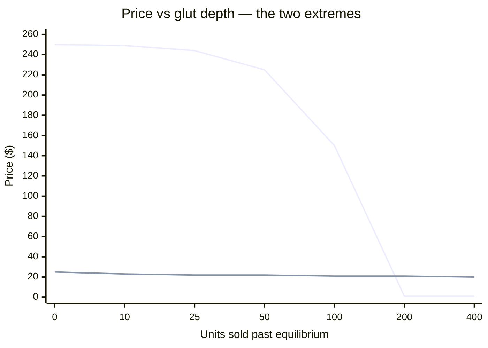

[← 02 Game Rules](02-game-rules.md) | **03 — Market Economics** | [Next: Town Demand →](04-town-demand.md)

---

# 03 — Market Economics


**This is the most important document in the set.** Everything else derives from it.

The competition publishes the price *formula* but not its *behaviour*. Reimplementing it
and studying the resulting curves reveals that the nine products behave almost nothing
alike, and that the difference decides which strategies can possibly work.

---

## 📐 The formula

Both players sell into **one shared market**. Each product starts with an inventory of
`I0 = 10,000` units.

```
price(inventory) = base + sign × amp × f(|inventory − I0|)

  sign = +1   if inventory < I0    scarcity  → price rises
  sign = −1   if inventory > I0    glut      → price falls

  amp  = target × base / f(T)

  f    ∈ { linear,  sq,  sqrt,  log }
         where log means ln(1+x), so f(0) = 0
```

Result is floored at **$1** and rounded to the nearest dollar.

### The subtlety that matters

> [!IMPORTANT]
> **Each product picks its own shape function AND its own steepness independently for each
> side of equilibrium.** A product can be violently sensitive to oversupply while barely
> reacting to scarcity, or the reverse. This is deliberate — it makes products with similar
> production profiles play completely differently.

`T` is a calibration constant: the production capacity of one 5×5 field over 24 days.
`target` means "moving `T` units past `I0` shifts the price by `target × base`."

---

## 📊 The parameter table

| Product | Base | T | Below func | Below target | Above func | Above target |
|---|---|---|---|---|---|---|
| 🌾 Wheat | 25 | 400 | `sqrt` | 0.80 | **`log`** | 0.20 |
| 🥕 Carrot | 35 | 450 | `log` | 0.20 | `sqrt` | 0.70 |
| 🍅 Tomato | 60 | 200 | `linear` | 0.40 | `sqrt` | 0.60 |
| 🍓 Strawberry | 120 | 100 | `sqrt` | 0.70 | **`linear`** | **1.60** |
| 🍈 Melon | 250 | 300 | `log` | 0.20 | **`sq`** | **3.60** |
| 🥚 Egg | 50 | 332 | `linear` | 0.40 | **`log`** | 0.20 |
| 🥛 Milk | 160 | 122 | `sqrt` | 0.60 | **`linear`** | **1.60** |
| 🧶 Wool | 200 | 105 | `log` | 0.20 | **`sq`** | **3.20** |
| 💩 Fertilizer | 100 | 200 | `linear` | 0.40 | `linear` | 0.40 |

**Read the "Above func" column** — it determines everything about oversupply risk:

| Shape | Behaviour under glut | Products |
|---|---|---|
| `log` | 🟢 Flattens out — **essentially uncrashable** | Wheat, Egg |
| `sqrt` | 🟡 Decelerating — forgiving | Carrot, Tomato |
| `linear` | 🟠 Steady collapse | Strawberry, Milk, Fertilizer |
| `sq` | 🔴 **Accelerating — catastrophic** | Melon, Wool |

---

## ✅ Verification

The model is only trustworthy if it reproduces the published reference points. The official
README gives `P(I0−T)`, `P(I0+T)`, and `P(I0+2T)` for all nine products.

```
RESOURCE      P(I0-T)         P(I0+T)         P(I0+2T)
WHEAT           45 vs 45  ok    20 vs 20  ok    19 vs 19  ok
CARROT          42 vs 42  ok    10 vs 10  ok     1 vs 1   ok
TOMATO          84 vs 84  ok    24 vs 24  ok     9 vs 9   ok
STRAWBERRY     204 vs 204 ok     1 vs 1   ok     1 vs 1   ok
MELON          300 vs 300 ok     1 vs 1   ok     1 vs 1   ok
EGG             70 vs 70  ok    40 vs 40  ok    39 vs 39  ok
MILK           256 vs 256 ok     1 vs 1   ok     1 vs 1   ok
WOOL           240 vs 240 ok     1 vs 1   ok     1 vs 1   ok
FERTILIZER     140 vs 140 ok    60 vs 60  ok    20 vs 20  ok

All nine rows reproduced exactly: True
```

> [!TIP]
> ✅ **All 27 reference values match exactly.** Every number in these documents rests on
> this check. The implementation lives in
> `../kaggriculture-analysis/analysis/market_model.py`.

---

## 💥 Crash points

The critical question per product: **how many units can you dump before the price hits the
$1 floor?**

| Product | Crashes at glut of | Fragility |
|---|---|---|
| 🧶 Wool | **+59** | 🔴🔴🔴 extreme |
| 🍓 Strawberry | **+62** | 🔴🔴🔴 extreme |
| 🥛 Milk | **+76** | 🔴🔴🔴 extreme |
| 🍈 Melon | **+158** | 🔴🔴 high |
| 💩 Fertilizer | +493 | 🟠 moderate |
| 🍅 Tomato | +529 | 🟠 moderate |
| 🥕 Carrot | +842 | 🟡 low |
| 🌾 Wheat | **never** | 🟢 immune |
| 🥚 Egg | **never** | 🟢 immune |

> [!WARNING]
> **Selling 59 wool in a season destroys the wool market.** Selling 62 strawberries
> destroys strawberries. These are tiny numbers — a handful of animals produces them in
> days. The premium products cannot absorb volume.

---

## 📉 Price decay curves

Marginal price per unit at increasing glut depth:

| Product | +0 | +10 | +25 | +50 | +100 | +200 | +400 | +800 | +1600 |
|---|---|---|---|---|---|---|---|---|---|
| 🌾 Wheat | 25 | 23 | 22 | 22 | 21 | 21 | 20 | 19 | **19** |
| 🥚 Egg | 50 | 46 | 44 | 43 | 42 | 41 | 40 | 38 | **37** |
| 🥕 Carrot | 35 | 31 | 29 | 27 | 23 | 19 | 12 | 2 | 1 |
| 🍅 Tomato | 60 | 52 | 47 | 42 | 35 | 24 | 9 | 1 | 1 |
| 💩 Fertilizer | 100 | 98 | 95 | 90 | 80 | 60 | 20 | 1 | 1 |
| 🍓 Strawberry | 120 | 101 | 72 | 24 | **1** | 1 | 1 | 1 | 1 |
| 🥛 Milk | 160 | 139 | 108 | 55 | **1** | 1 | 1 | 1 | 1 |
| 🧶 Wool | 200 | 194 | 164 | 55 | **1** | 1 | 1 | 1 | 1 |
| 🍈 Melon | 250 | 249 | 244 | 225 | 150 | **1** | 1 | 1 | 1 |



Note the shapes: **melon holds its value beautifully then falls off a cliff** (quadratic),
while **wheat drops slightly and then essentially never moves again** (logarithmic).

---

## 💵 Cumulative revenue

What you actually collect selling N units starting from equilibrium:

| Product | 50 units | 100 units | 200 units | 400 units | 1,000 units |
|---|---|---|---|---|---|
| 🍈 Melon | $12,098 | $21,721 | $26,527 | $26,727 | $27,327 |
| 🥚 Egg | $2,244 | $4,371 | $8,510 | $16,559 | **$39,799** |
| 💩 Fertilizer | $4,755 | $9,010 | $16,020 | $24,040 | $25,552 |
| 🌾 Wheat | $1,127 | $2,193 | $4,293 | $8,313 | **$20,043** |
| 🧶 Wool | $7,655 | $7,969 | $8,069 | $8,269 | $8,869 |
| 🥛 Milk | $5,430 | $6,205 | $6,305 | $6,505 | $7,105 |
| 🍅 Tomato | $2,411 | $4,318 | $7,221 | $10,453 | $11,599 |
| 🥕 Carrot | $1,482 | $2,738 | $4,832 | $7,853 | $10,838 |
| 🍓 Strawberry | $3,648 | $3,847 | $3,947 | $4,147 | $4,747 |

> [!IMPORTANT]
> **Read the last column.** Wool caps out around $8,900 no matter how much you produce.
> Strawberry caps around $4,700. But **eggs keep paying — $39,799 for 1,000 units** — and
> wheat keeps paying too. The "cheap" products have effectively unbounded revenue ceilings;
> the "premium" ones have hard caps.

This inverts the naive intuition that expensive products are better.

---

## 🎯 Marginal value

Cumulative revenue is the wrong measure for decisions. The right one is: **if I produce one
more unit, what does it actually add** — accounting for the fact that extra supply also
lowers the price of everything else you sell.

Marginal $/unit on top of a strong agent's existing production:

| Product | +30 units | +60 | +120 | +240 |
|---|---|---|---|---|
| 🍈 Melon | **$111** | $72 | $32 | $13 |
| 🧶 Wool | **$92** | $82 | $62 | $30 |
| 🥛 Milk | $82 | **$84** | $53 | ❌ −$71 |
| 🍓 Strawberry | $75 | $50 | ❌ −$2 | ❌ −$59 |
| 🍅 Tomato | $74 | $73 | **$66** | **$48** |
| 🥚 Egg | $56 | $55 | **$52** | **$45** |
| 🥕 Carrot | $40 | $40 | $37 | $30 |
| 💩 Fertilizer | $37 | $34 | $28 | $17 |
| 🌾 Wheat | $20 | $19 | $12 | $3 |

> [!TIP]
> **The flat columns are the opportunity.** Tomato and egg barely decline even at +240
> units — they can absorb enormous volume without losing value. Strawberry and milk go
> *negative*: producing more actively destroys money.

> [!WARNING]
> A negative marginal value means the extra units crash the price so far that you earn less
> in total than if you'd produced nothing extra. Strawberry turns negative at just +120.

---

## 🧠 Strategic consequences

### 1. Premium products are volume traps

| | |
|---|---|
| Wool: 50 units | $7,655 |
| Wool: 1,000 units | $8,869 |
| **20× the production, 16% more money** | 🔴 |

Producing wool is fine. Producing *lots* of wool is nearly worthless.

### 2. Cheap products have no ceiling

Eggs at 1,000 units return $39,799 — **more than any premium product at any volume.** Wheat
returns $20,043. Both are immune to gluts because of their logarithmic curves.

### 3. Buy/sell arbitrage is closed

Buy price quotes at post-buy inventory, sell price at pre-sell inventory. A round trip nets
exactly zero. Don't look for free money here.

### 4. The $1 floor is deliberately sticky

Sales at $1 pay you but **do not** add to market inventory, so the floor stays responsive
to subsequent buying. You cannot bury a product permanently.

---

## 🔗 What this feeds into

This document establishes how prices respond to *supply*. The other half of the picture is
**demand**, which regenerates continuously and pushes prices back up — covered next.

> [!NOTE]
> The crash points above assume nothing drains inventory. In reality the town consumes
> constantly, which changes the picture dramatically for seven of the nine products.
> See [04 — Town Demand & Flow](04-town-demand.md).

---

[← 02 Game Rules](02-game-rules.md) | **03 — Market Economics** | [Next: Town Demand →](04-town-demand.md)
