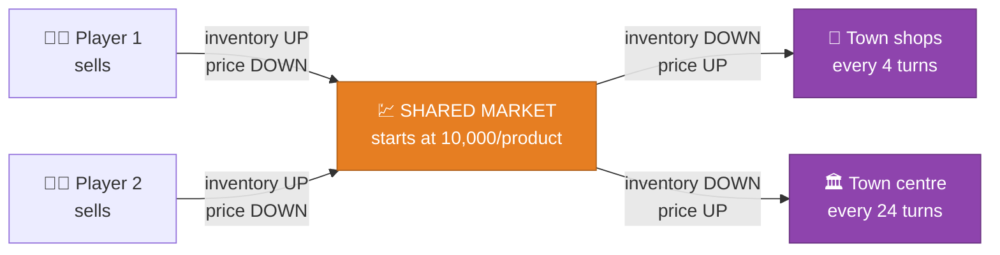
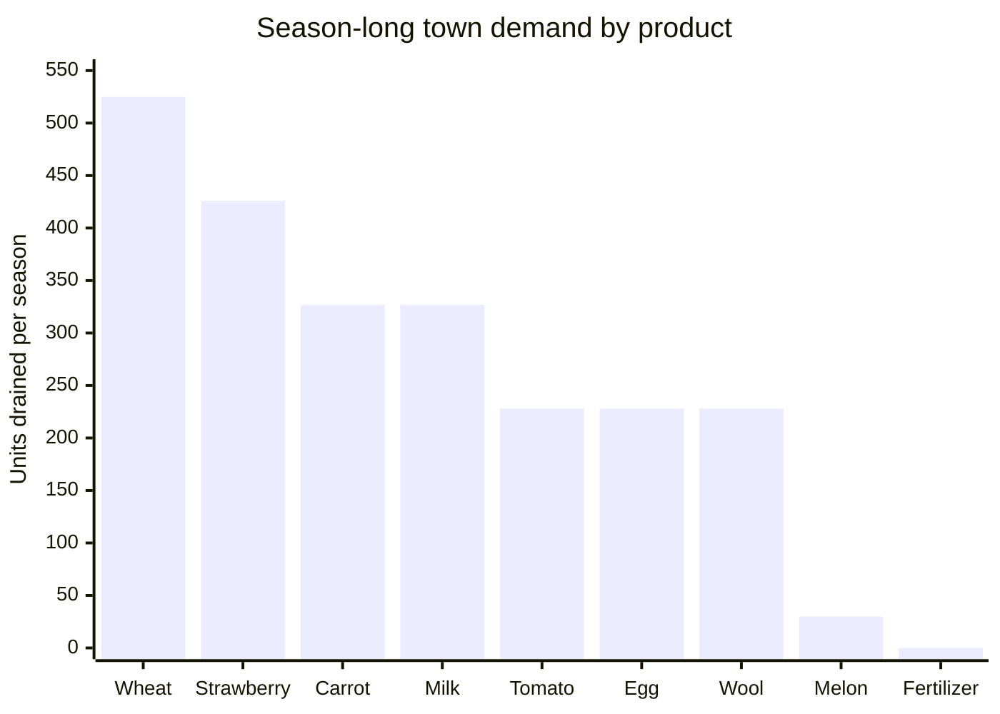
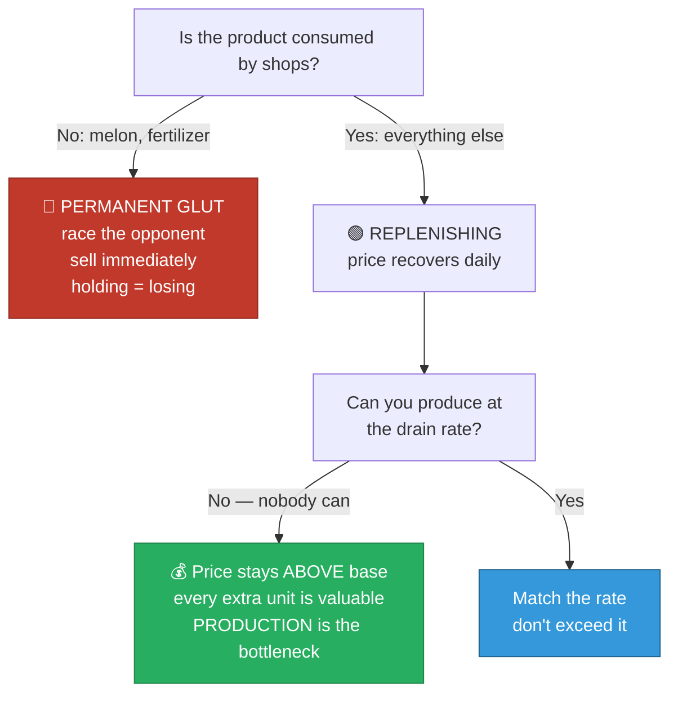

[← 03 Market Economics](03-market-economics.md) | **04 — Town Demand & Flow** | [Next: Agent Teardown →](05-agent-teardown.md)

---

# 04 — Town Demand & The Flow System


> [!IMPORTANT]
> **The market is a flow system, not a stock.** This single reframing changes every
> conclusion about what to produce. Most players model the market as a fixed pool of demand
> to be drained. It isn't — it **refills continuously**, and the refill rate differs
> enormously by product.

---

## 🏘️ How the town works

Two independent consumers drain market inventory:



### The town centre

Consumes **1 of every product except fertilizer, once per day**. Flat for the whole season.
30 units per product over 30 days.

### The shops

| Rule | Detail |
|---|---|
| Unlock schedule | One every 3 days — days 3, 6, 9, 12, 15, 18, 21, 24 |
| Selection | **Uniformly at random WITH replacement** |
| Cap | 8 instances total |
| Consumption | Each instance takes 1 of every product it wants, **every 4 turns** (= 6×/day) |
| Single-product shops | Consume **2×** |
| Permanence | Once unlocked, active for the rest of the season |

> [!NOTE]
> Because shops are drawn **with replacement**, a season can end up with three bakeries and
> no yarn store. Demand composition is genuinely random, which is a major source of
> variance between games.

### Shop menu

| Shop | Demands |
|---|---|
| 🥐 Bakery | eggs, wheat |
| 🍕 Pizza Shop | milk, tomatoes, wheat |
| 🍳 Brunch Spot | eggs, wheat, strawberries |
| 🧶 Yarn Store | **wool (2×)** |
| 🍦 Ice Cream Shop | strawberries, milk, wheat |
| 🐾 Pet Cafe | **carrots (2×)** |
| 🥤 Smoothie Shop | strawberries, milk |
| 🧺 Farmers Market | wheat, carrots, tomatoes, strawberries |

---

## 📊 Season-long drain per product

Total shop-instance-days over a season = 27+24+21+18+15+12+9+6 = **132**.

Expected drain, combining shops (weighted by how many shop types demand each product) and
the town centre:

| Product | Shops demanding it | Drain/season | Refill rate |
|---|---|---|---|
| 🌾 Wheat | 5 of 8 | **525** | 🟢🟢🟢 very high |
| 🍓 Strawberry | 4 of 8 | **426** | 🟢🟢🟢 very high |
| 🥕 Carrot | 2 of 8 (one is 2×) | **327** | 🟢🟢 high |
| 🥛 Milk | 3 of 8 | **327** | 🟢🟢 high |
| 🍅 Tomato | 2 of 8 | **228** | 🟢 moderate |
| 🥚 Egg | 2 of 8 | **228** | 🟢 moderate |
| 🧶 Wool | 1 of 8 (2×) | **228** | 🟢 moderate |
| 🍈 **Melon** | **0 of 8** | **30** | 🔴 town centre only |
| 💩 **Fertilizer** | **0 of 8** | **0** | 🔴🔴 **nothing at all** |



---

## 🔴 The two exceptions

> [!CAUTION]
> **No shop demands melon.** Only the town centre takes it — 1 per day, 30 all season.
>
> **Nothing whatsoever consumes fertilizer.** The town centre explicitly excludes it and no
> shop wants it.

These two products have **permanent gluts**. Once you push their inventory up, it never
comes back down. They are one-shot pools that both players race to drain.

| | Melon | Fertilizer |
|---|---|---|
| Regeneration | 30/season | **zero** |
| Crash point | +158 | +493 |
| Total extractable, **both players combined** | ~$27,000 | ~$25,500 |
| Correct strategy | 🏃 Sell early, beat the opponent to it | 🏃 Same |
| Holding inventory | ❌ Strictly loses value | ❌ Strictly loses value |

Every other product **replenishes**, which means the right question is never "how much can
I sell in total" but **"what rate can I sustain?"**

---

## 🔄 What "flow" means in practice

### Sustainable sales rate at 8 shops active

Once all shops are unlocked (day 24 onward), daily drain per product:

| Product | Units/day | Value at base | Daily revenue if you match it |
|---|---|---|---|
| 🌾 Wheat | 31 | $25 | $775 |
| 🍓 Strawberry | 25 | $120 | **$3,000** |
| 🥕 Carrot | 19 | $35 | $665 |
| 🥛 Milk | 19 | $160 | **$3,040** |
| 🍅 Tomato | 13 | $60 | $780 |
| 🥚 Egg | 13 | $50 | $650 |
| 🧶 Wool | 13 | $200 | **$2,600** |
| 🍈 Melon | 1 | $250 | $250 |
| 💩 Fertilizer | 0 | — | $0 |

> [!TIP]
> **Sell at or below the drain rate and the price never falls.** Sell above it and you
> start eating into your own margins. This gives a clean production target for every
> product — something no amount of clever selling logic can substitute for.

### The consequence for premium goods

Strawberry, milk, and wool all have **high value AND high drain** — they are the best
products in the game *if you can produce at rate*. But they also have the lowest crash
points (+62, +76, +59), meaning there is a narrow band between "not enough" and "market
destroyed."

Can you produce 25 strawberries a day? A strawberry tile yields 0.24 units/day. You'd need
**over 100 tiles**. In practice nobody comes close, which is exactly why these products end
seasons trading far above base — see [07 — The Diagnosis](07-diagnosis.md).

---

## 🧮 Prices go UP when nobody produces

Because the town drains continuously, a product that nobody supplies has its inventory
pushed **below** `I0`, and the below-equilibrium curve raises the price.

Example — strawberry, `below_func = sqrt`, `below_target = 0.7`:

```
amp = 0.7 × 120 / sqrt(100) = 8.4
price(I0 − 169) = 120 + 8.4 × sqrt(169) = 120 + 109 = $229
```

That's **191% of base price**, purely because supply lagged demand.

| Product | Observed end-of-season deficit | Resulting price | vs base |
|---|---|---|---|
| 🍓 Strawberry | −169 | $229 | 191% |
| 🥛 Milk | −106 | $249 | 156% |
| 🌾 Wheat | −215 | $40 | 160% |
| 🧶 Wool | −105 | $240 | 120% |
| 🍅 Tomato | −153 | $78 | 130% |
| 🥕 Carrot | −297 | $42 | 120% |
| 🥚 Egg | −135 | $58 | 116% |

---

## 🎯 Summary



> [!IMPORTANT]
> **Almost every product falls into the green box.** No realistic agent can produce at the
> town's drain rate for the premium goods. That means the market is permanently starving,
> prices sit above base, and **the binding constraint is production capacity, not sales
> strategy.**
>
> This prediction was tested directly and confirmed — see
> [07 — The Diagnosis](07-diagnosis.md).

---

[← 03 Market Economics](03-market-economics.md) | **04 — Town Demand & Flow** | [Next: Agent Teardown →](05-agent-teardown.md)
