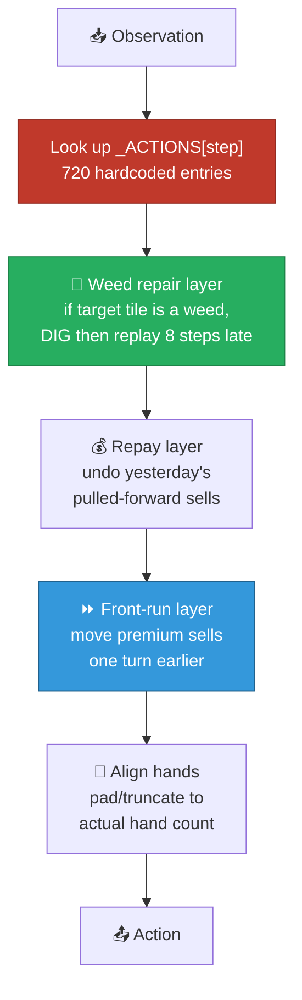
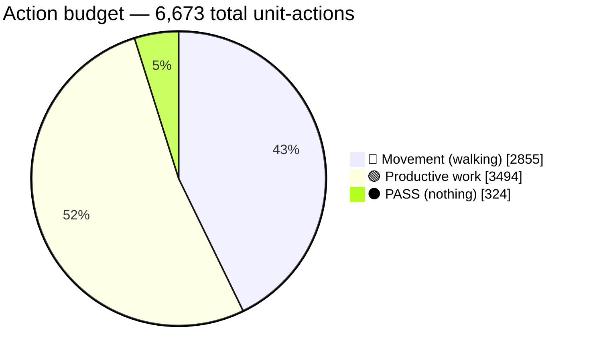

[← 04 Town Demand](04-town-demand.md) | **05 — Agent Teardown** | [Next: Methodology →](06-methodology.md)

---

# 05 — Agent Teardown


What the submitted agent actually is, how it works, and its complete behavioural profile.

---

## 🔍 What's inside

The notebook `v16-rc5-high-score-8c-4s-premium-market-lead.ipynb` contains a `main.py`
whose first meaningful line is a large compressed blob:

```python
_ACTIONS = json.loads(zlib.decompress(base64.b85decode('c-qxnO>Z075&SPY...')).decode("utf-8"))
```

Decoding it yields a **list of 720 dictionaries** — one per turn — each containing the
exact `farmer`, `hands`, and `market` actions to issue.

```python
def agent(obs):
    step = min(max(0, int(obs.get("step", 0))), len(_ACTIONS) - 1)
    action = _weed_repair_action(obs, _copy_action(_ACTIONS[step]), step)
    ...
    return _align_hands(action, obs)
```

> [!IMPORTANT]
> **This is an open-loop agent.** On turn `N` it replays action `N` from the recording,
> essentially regardless of what is happening on the board. It does not perceive, plan, or
> react. The only state it consults is a small weed-repair check.

### Architecture



Only the green and blue boxes contain any logic. Everything else is playback.

---

## 📜 Provenance

> [!WARNING]
> **The agent is not original work.**
>
> Cell 10 of the notebook states it plainly: the 8C/4S production schedule was
> reconstructed from public replay analysis of Kaggle user **Nikita Lugovoy**, submission
> `55440039`, episodes `92165990`, `92185587`, and `92223213`. The notebook takes the
> majority action across three of that competitor's replays at each decision step.
>
> Analysing public replays is normal and permitted on Kaggle. But most competition rules
> carry an "individually and independently developed" clause, and this competition pays
> $5,000 for top-10. **Read the Kaggriculture rules page before publishing this under your
> name.**

---

## 📊 Complete action profile

Every action across all 720 turns, all workers:

| Action | Count | Share | Category |
|---|---|---|---|
| `WATER` | 1,010 | 15.1% | 🟢 productive |
| `CARE` | 967 | 14.5% | 🟢 productive |
| **`NORTH`** | 838 | 12.6% | 🔴 movement |
| **`WEST`** | 811 | 12.2% | 🔴 movement |
| **`EAST`** | 652 | 9.8% | 🔴 movement |
| **`SOUTH`** | 554 | 8.3% | 🔴 movement |
| `HARVEST` | 390 | 5.8% | 🟢 productive |
| **`PASS`** | 324 | 4.9% | ⚫ nothing |
| `COLLECT_FERTILIZER` | 296 | 4.4% | 🟢 productive |
| `FEED` | 290 | 4.3% | 🟢 productive |
| `PLANT` | 199 | 3.0% | 🟢 productive |
| `PICKUP` | 135 | 2.0% | 🟡 logistics |
| `FERTILIZE` | 72 | 1.1% | 🟢 productive |
| `DROP` | 69 | 1.0% | 🟡 logistics |
| `DIG` | 40 | 0.6% | 🟢 productive |
| `BUILD_PASTURE` | 13 | 0.2% | 🟢 productive |
| `PLACE` | 13 | 0.2% | 🟢 productive |

### The headline



| Category | Count | Share |
|---|---|---|
| 🔴 **Movement** | **2,855** | **42.8%** |
| ⚫ PASS | 324 | 4.9% |
| 🟢 Productive | 3,494 | 52.4% |

> [!CAUTION]
> **Nearly 43% of all effort is spent walking.** This looked like the single biggest
> opportunity in the game — and in a rewritten agent it still is. But it cannot be fixed by
> patching a replay, because the route *is* the recording. See
> [12 — Roadmap](12-roadmap.md).

---

## 💹 Trading profile

### What it sells

| Product | Units sold |
|---|---|
| 🌾 Wheat | 479 |
| 🥛 Milk | 320 |
| 💩 Fertilizer | 300 |
| 🍓 Strawberry | 300 |
| 🧶 Wool | 154 |
| 🍈 Melon | 126 |
| 🥚 Egg | **0** |
| 🥕 Carrot | **0** |
| 🍅 Tomato | **0** |

> [!TIP]
> **Three entire demand channels are untouched.** Egg, carrot, and tomato together
> represent ~780 units/season of replenishing demand that this agent completely ignores.
> See [12 — Roadmap](12-roadmap.md).

### What it buys

| Purchase | Quantity | Approx cost |
|---|---|---|
| `BUY_PRODUCT` wheat | 189 | ~$5,000 |
| `BUY_SEED` wheat | 144 | $1,440 |
| `BUY_SEED` strawberry | 37 | $3,700 |
| `BUY_SEED` melon | 20 | $1,600 |
| `BUY_ANIMAL` cow | **8** | $3,200 |
| `BUY_ANIMAL` sheep | **4** | $2,000 |
| `BUY_LAND` | 2 | $3,000 |

Hence the notebook title: **8 Cows / 4 Sheep**. It buys 3 of the 4 quadrants (75 tiles) and
**never buys the fourth**.

### Labour

| Metric | Value |
|---|---|
| Total hand-days hired | 264 |
| Total hire spend | $7,156 |
| Average cost per hand-day | ~$27 |
| Hire spend as % of revenue | 3.4% |

Hands per day, across the season:

```
Day:   0  1  2  3  4  5  6  7  8  9 10 11 12 13 14
Hands: 5  1  2  3  4  3  4  7  6  7 14 10 10  8  9

Day:  15 16 17 18 19 20 21 22 23 24 25 26 27 28 29
Hands: 9 13  9 11 13 14 12 10 14 11 12 12 11 10 10
```

It ramps to 10–14 hands/day from day 10 onward. **This is already near the economic
optimum** — see [09 — Dead Ends](09-dead-ends.md).

---

## 💰 Cash and market trajectory

Playing against a passive opponent:

| Day | Money | Market glut (negative = scarce) |
|---|---|---|
| 3 | $9 | fertilizer +5, everything else slightly negative |
| 6 | $13 | strawberry −24, milk −24, fertilizer +20 |
| 9 | $1,043 | strawberry −63, milk −45, fertilizer +41 |
| 12 | $8,980 | strawberry −120, milk −81, melon +18, fert +72 |
| 15 | $15,268 | strawberry −177, milk −102, fert +101 |
| 18 | $39,588 | strawberry −212, wheat −146, fert +119 |
| 21 | $82,011 | melon +69, fert +124 |
| 24 | $115,420 | carrot −240, wool −80, fert +146 |
| 27 | $146,573 | carrot −297, egg −135, fert +179 |
| **30** | **$181,057** | — |

> [!WARNING]
> **Days 0–9 are financially razor-thin** — money hovers between $9 and $1,043 while the
> agent buys cows, land, and seeds. The whole plan is financed by early wheat and
> fertilizer sales. This fragility is what destroyed experiment V17; see
> [08 — Experiments](08-experiments.md#v17--adaptive-reserve-price-seller).

---

## ⚠️ Structural weaknesses

| # | Weakness | Severity |
|---|---|---|
| 1 | **Open-loop** — cannot react to anything except weeds | 🔴 fundamental |
| 2 | **Capital ladder unguarded on money** — if early sales underperform, cow purchases silently fail and the agent feeds empty pastures for 20 days | 🔴 high |
| 3 | **42.8% movement overhead** | 🟠 large but needs a rewrite |
| 4 | **Three demand channels ignored** (egg, carrot, tomato) | 🟠 large but needs a rewrite |
| 5 | **Shop-draw variance** — recorded under one random shop draw; revenue ranges $169k–$248k across draws | 🟡 unavoidable |
| 6 | **Never buys the 4th quadrant** | 🟡 turns out not to matter |

### The turn-0 order overflow (investigated, minor)

Turn 0 issues ten market orders totalling ~$3,212 against $3,000 of cash:

```diff
  BUY_PRODUCT WHEAT 14   ~$350
  HIRE ×4                  $7
  BUY_ANIMAL COW 1       $400
  BUY_ANIMAL SHEEP 4   $2,000     ← running total $2,757
- BUY_SEED MELON 5       $400     ← only 2 of 5 purchased, money exhausted
- BUY_SEED WHEAT 5        $50     ← fails
- HIRE (5th)               $5     ← fails
```

Measured state after turn 0: `money=$3`, `seeds={WHEAT:3, MELON:2}`, `hands=4`.

> [!NOTE]
> **I initially reported this as a significant bug. It is not.** Turn 1 issues
> `SELL WHEAT 9`, `BUY_SEED MELON 3`, `BUY_SEED WHEAT 2` — restoring seeds to the intended
> `MELON:5, WHEAT:5`. **The recording self-heals.** Actual loss: about one worker on day 0.
> See [11 — Mistakes & Corrections](11-mistakes-and-corrections.md).

---

## 📈 Measured baseline performance

| Opponent | Result |
|---|---|
| Itself (mirror) | 124,172 vs 123,166 |
| `starter` (built-in) | 131,869 vs 3,504 |
| `pass` (does nothing) | **181,057** |

Note the mirror match is much lower than the solo figure — when both players sell into the
same market, prices crash and total revenue nearly halves.

---

[← 04 Town Demand](04-town-demand.md) | **05 — Agent Teardown** | [Next: Methodology →](06-methodology.md)
