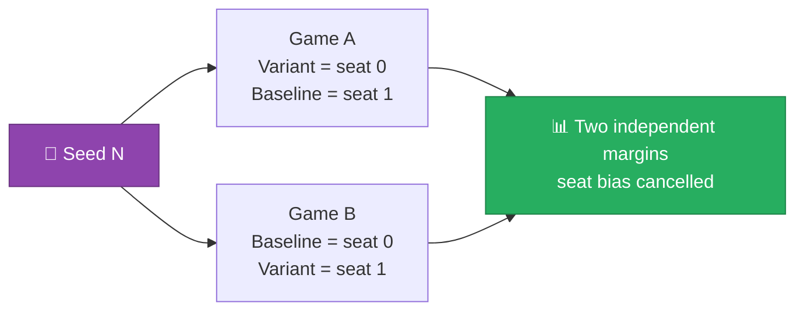

[← 05 Agent Teardown](05-agent-teardown.md) | **06 — Methodology** | [Next: The Diagnosis →](07-diagnosis.md)

---

# 06 — Methodology


How every number in these documents was measured, and the trap that would have invalidated
all of them.

---

## 🛠️ Getting the real engine

```bash
pip install -U kaggle-environments
```

The `kaggriculture` environment ships inside that package (version 1.32.6 at time of work).
Confirming it exists:

```python
from kaggle_environments import make
env = make('kaggriculture', configuration={'episodeSteps': 720})
env.run(['pass', 'pass'])
```

A full 720-turn season runs in **~7 seconds**, which makes real experimentation practical —
30 games per comparison takes about 3.5 minutes.

> [!TIP]
> The engine source is readable and worth consulting. On this machine:
> `C:\Users\amero\anaconda3\Lib\site-packages\kaggle_environments\envs\kaggriculture\kaggriculture.py`
> Two findings in these docs came from reading it directly rather than from the rules.

---

## ⚠️ The trap: seat advantage

> [!CAUTION]
> **Player 0 has a structural advantage of roughly $1,006.**
>
> Measured by playing the baseline agent against an identical copy of itself:
> **124,172 vs 123,166**. Same agent, same logic, different seat — and a consistent
> thousand-dollar gap.

This is large enough to completely fabricate a result. If you test a new variant only in
seat 0, it inherits a $1,006 head start and can look like an improvement while actually
being worse.

### The fix: paired two-seat testing

Every comparison plays each matchup **twice per seed** — once with the variant in seat 0,
once in seat 1 — so the advantage cancels exactly.



With **15 seeds × 2 seat orders = 30 games** per comparison.

---

## 🔬 The harness

`../kaggriculture-analysis/analysis/harness.py`:

```python
def play(a, b, seed):
    env = make('kaggriculture',
               configuration={'episodeSteps': 720, 'seed': seed}, debug=False)
    env.run([a, b])
    last = env.steps[-1]
    return last[0].reward, last[1].reward, [s.status for s in last]


def duel(a, b, seeds, label=''):
    """Both seat orders per seed. Reports W-T-L and mean margin for agent A."""
    margins = []
    for sd in seeds:
        r0, r1, st = play(a, b, sd)
        margins.append(r0 - r1)          # A in seat 0
        r1b, r0b, st2 = play(b, a, sd)
        margins.append(r0b - r1b)        # A in seat 1
    w = sum(1 for m in margins if m > 0)
    t = sum(1 for m in margins if m == 0)
    l = sum(1 for m in margins if m < 0)
    ...
```

Usage:

```python
from harness import duel
duel('v19/main.py', 'base/main.py', range(1, 16), 'V19 vs BASE')
# V19 (no-op salvage) vs BASE   W-T-L  9-0-21 (30.0%)  mean margin -68  median -48
```

### What it checks

| Check | Why |
|---|---|
| Both seat orders | Cancels the $1,006 bias |
| 15 distinct seeds | Shop draws are random; a single seed proves nothing |
| `status` per player | Catches crashes that would show as a "win" for the opponent |
| Mean **and** median margin | Median resists outlier games |
| W-T-L counts | Rating depends on wins, not margin |

> [!IMPORTANT]
> **Reporting W-T-L matters more than margin here.** The competition's rating system only
> reads win/loss/tie. A variant with a great mean margin but a 40% win rate is worse than
> one with a tiny margin and 60% wins.

---

## 📉 The offline market simulator

Before touching the engine, I built a standalone simulator
(`analysis/market_model.py`) that replays a sell schedule through the price curve plus
town demand. It's much faster than the engine and allowed exploring hypotheses cheaply.

### Validating the simulator

| Source | Mirror-match revenue |
|---|---|
| Offline simulator prediction | ~$121,000 |
| Real engine, measured | ~$124,000 |

> [!TIP]
> ✅ **Within 2.5%.** The simulator was trustworthy enough for exploration, though every
> final claim in these docs was confirmed against the real engine.

---

## 🎲 Handling randomness

Two independent random elements create variance:

| Source | Effect |
|---|---|
| **Shop draw** | 8 shops drawn uniformly **with replacement** → demand composition varies wildly |
| **Weed spawn** | 0.5% per empty tile per day → ~7 weeds/season |

Measured impact of shop draw alone on total revenue: **$169,274 – $247,938** across six
draws. That is a **47% spread** from randomness alone.

> [!WARNING]
> **This is why single-game comparisons are meaningless.** A difference of $20,000 in one
> game is well inside noise. Any claimed improvement smaller than the shop-draw spread
> requires many seeds to detect.

---

## 🧾 Diagnostic instrumentation

Beyond win/loss, I instrumented full-season trajectories by stepping the environment
manually and snapshotting state:

```python
env.reset(2)
st = env.state
while not env.done and step < 720:
    acts = [mod.agent(obs_for(0)), passive_agent(obs_for(1))]
    st = env.step(acts)
    if step % 72 == 0:
        record(money, shed_contents, market_inventory - 10000)
```

This produced the money trajectory and the market-glut evolution in
[05 — Agent Teardown](05-agent-teardown.md), and directly produced the central finding in
[07 — The Diagnosis](07-diagnosis.md).

> [!NOTE]
> **This is what actually cracked the problem.** Win/loss numbers tell you *that* a variant
> failed; the trajectory tells you *why*. V17's failure was invisible in its W-T-L record
> but obvious the moment I plotted money against day and saw it flatline at $0 on day 6.

---

## ✅ Standards applied

| Standard | Rationale |
|---|---|
| Both seat orders, always | Seat bias is $1,006 |
| ≥15 seeds per comparison | Shop-draw variance is ±47% |
| Verify model against published reference | The price model reproduces all 9 official rows |
| Confirm simulator against real engine | 2.5% agreement before trusting it |
| Check agent `status`, not just reward | A crash can masquerade as a result |
| Diagnose failures, don't just record them | Every failure here has an identified mechanical cause |

---

[← 05 Agent Teardown](05-agent-teardown.md) | **06 — Methodology** | [Next: The Diagnosis →](07-diagnosis.md)
