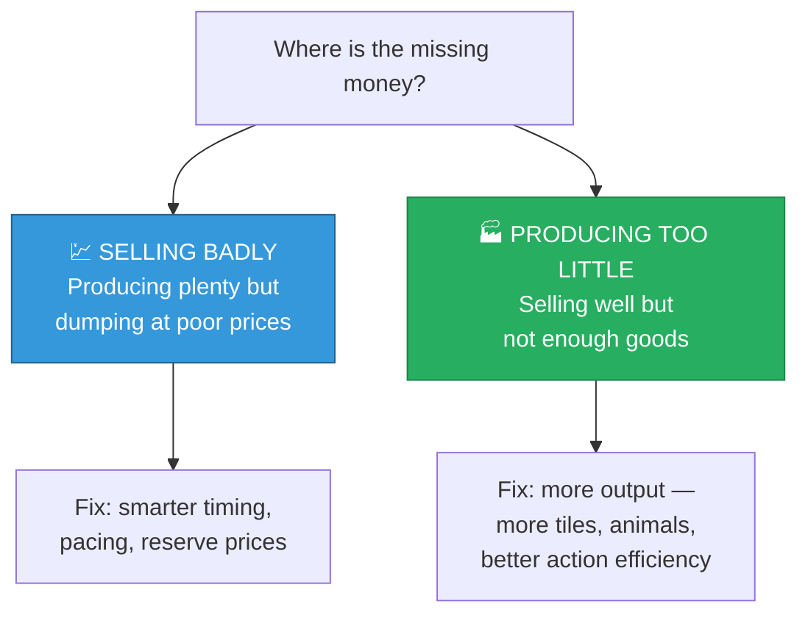
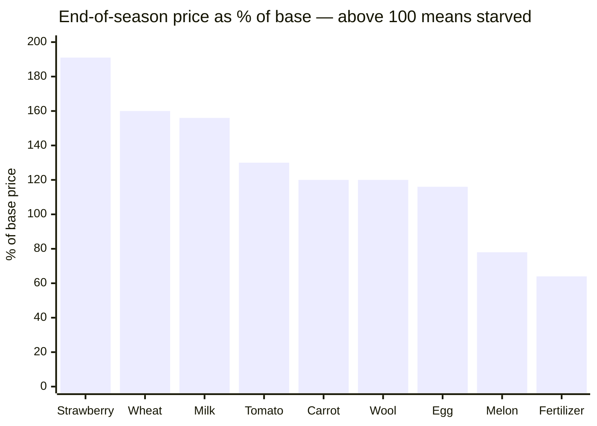

[← 06 Methodology](06-methodology.md) | **07 — The Diagnosis** | [Next: Experiments →](08-experiments.md)

---

# 07 — The Diagnosis


**The central result.** One measurement determined the direction of everything afterwards.

---

## ❓ The question

A strong agent finishes a season with ~$181,000 (against a passive opponent). Where is the
remaining money?

There are only two possibilities:



These call for completely different work. **Guessing wrong wastes the entire effort.**

Fortunately the market itself answers the question directly.

---

## 🔑 The test

> [!IMPORTANT]
> **If an agent were selling badly, it would be flooding the market and prices would end
> BELOW base. If it were producing too little, the town would out-drain it and prices would
> end ABOVE base.**
>
> The end-of-season price of every product is therefore a direct readout of which
> constraint binds.

I ran the baseline for a full season and recorded final market inventory for all nine
products.

---

## 📊 The result

| Product | Final glut | Final price | Base | vs base | Verdict |
|---|---|---|---|---|---|
| 🍓 Strawberry | **−169** | **$229** | $120 | **191%** | 🟢 starved |
| 🌾 Wheat | **−215** | **$40** | $25 | **160%** | 🟢 starved |
| 🥛 Milk | **−106** | **$249** | $160 | **156%** | 🟢 starved |
| 🍅 Tomato | **−153** | **$78** | $60 | **130%** | 🟢 starved |
| 🥕 Carrot | **−297** | **$42** | $35 | **120%** | 🟢 starved |
| 🧶 Wool | **−105** | **$240** | $200 | **120%** | 🟢 starved |
| 🥚 Egg | **−135** | **$58** | $50 | **116%** | 🟢 starved |
| 🍈 Melon | +75 | $194 | $250 | 78% | 🔴 oversupplied |
| 💩 Fertilizer | +179 | $64 | $100 | 64% | 🔴 oversupplied |



---

## 🎯 The conclusion

> [!IMPORTANT]
> ## Seven of nine products end the season trading ABOVE base price.
>
> **The agent is supply-constrained, not price-constrained.** The market is starving for
> goods that nobody produces. Every unit of effort spent making it sell more cleverly is
> wasted effort.

Strawberry finishing at **191% of base** is the clearest signal in the dataset. The agent
sold 300 strawberries over the season and *still* left the market so hungry that the price
nearly doubled. Producing more strawberries would have been almost pure profit.

---

## 🔴 The two exceptions confirm the model

The only oversupplied products are **melon** and **fertilizer** — and those are precisely
the two identified in [04 — Town Demand](04-town-demand.md) as having no shop demand:

| Product | Town drain/season | End state |
|---|---|---|
| 🍈 Melon | 30 (town centre only) | 🔴 +75 glut |
| 💩 Fertilizer | **0 — nothing consumes it** | 🔴 +179 glut |
| Everything else | 228 – 525 | 🟢 all starved |

> [!TIP]
> **This is a successful out-of-sample prediction.** The town-demand analysis was derived
> purely from the shop tables before any game was run, and it correctly identified — in
> advance — exactly which two of nine products would end up oversupplied. That gives real
> confidence in the model.

---

## 🧭 What this ruled out

The diagnosis eliminates an entire family of strategies:

```diff
- ❌ Reserve prices / holding stock for better prices
- ❌ Optimal sell pacing and scheduling
- ❌ Spreading large sales across turns
- ❌ Front-running the opponent's sales
- ❌ Any market-timing cleverness whatsoever
```

```diff
+ ✅ Producing more units
+ ✅ Making existing actions more productive
+ ✅ Opening untapped product lines
```

> [!NOTE]
> I did not simply accept this conclusion. I built and measured **four** market-side
> variants specifically to test it. All four failed, in ways that confirmed the diagnosis
> and revealed an additional structural constraint. See
> [08 — Experiments](08-experiments.md).

---

## 📐 Supporting evidence: the action budget

The diagnosis is corroborated by where the agent's effort actually goes:

| Category | Count | Share |
|---|---|---|
| 🔴 Movement | 2,855 | **42.8%** |
| ⚫ PASS | 324 | 4.9% |
| 🟢 Productive | 3,494 | 52.4% |

An agent that spends **43% of its effort walking** is obviously production-limited. Those
2,855 walking actions are the raw material for any real improvement — if they could be
converted into production at even $45/action, that is $128,000 of theoretical headroom.

> [!WARNING]
> "Theoretical" is doing real work in that sentence. You cannot eliminate all movement —
> workers must reach their tiles. But the gap between 43% and, say, 25% is enormous, and
> it is where a rewritten agent would find its gains.

---

## 🧮 Quantifying the opportunity

Marginal value of extra units on top of current production
(from [03 — Market Economics](03-market-economics.md)):

| Product | +30 | +60 | +120 | +240 | Assessment |
|---|---|---|---|---|---|
| 🍅 Tomato | $74 | $73 | $66 | $48 | 🟢 **huge untapped capacity** |
| 🥚 Egg | $56 | $55 | $52 | $45 | 🟢 **huge untapped capacity** |
| 🥕 Carrot | $40 | $40 | $37 | $30 | 🟢 solid, untapped |
| 🧶 Wool | $92 | $82 | $62 | $30 | 🟡 good but saturates |
| 🥛 Milk | $82 | $84 | $53 | ❌ −$71 | 🟡 near its limit |
| 🍈 Melon | $111 | $72 | $32 | $13 | 🟡 best per unit, small capacity |
| 🍓 Strawberry | $75 | $50 | ❌ −$2 | ❌ −$59 | 🔴 **already saturated** |

> [!IMPORTANT]
> **The flat rows are the prize.** Tomato and egg hold their value even at +240 units. The
> agent currently sells **zero of both**. Together with carrot, that is roughly 780
> units/season of replenishing demand sitting completely untouched.

---

## ➡️ Where this leads

The diagnosis says: produce more. The next two documents test that.

- [08 — Experiments](08-experiments.md) — four attempts to improve selling, all failed,
  and the structural reason why
- [09 — Dead Ends](09-dead-ends.md) — why "just buy more land and hire more workers" also
  fails, killed by arithmetic
- [12 — Roadmap](12-roadmap.md) — what would actually work

---

[← 06 Methodology](06-methodology.md) | **07 — The Diagnosis** | [Next: Experiments →](08-experiments.md)
