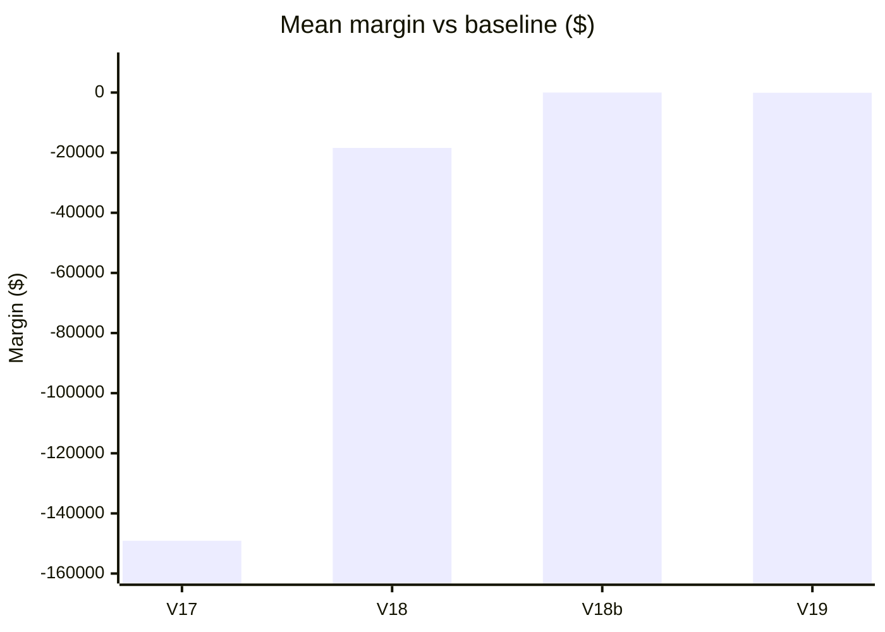
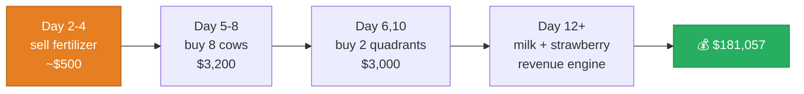
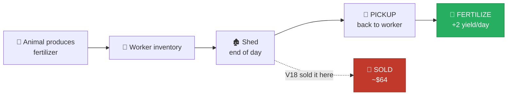
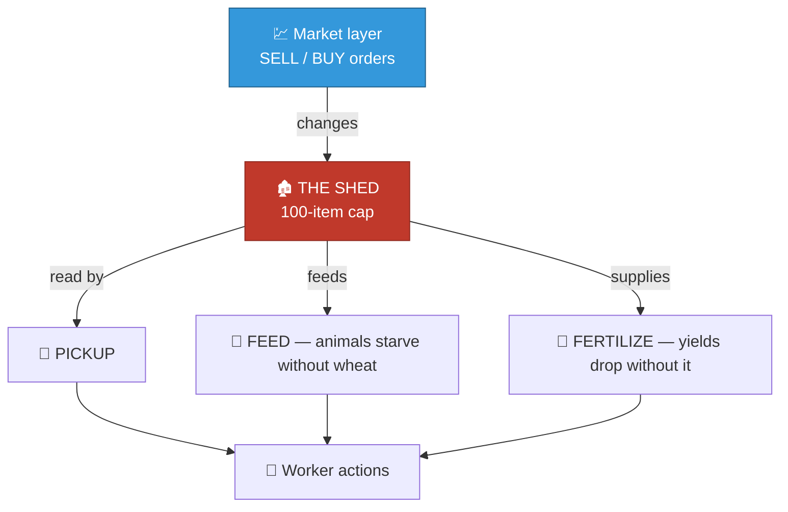

[← 07 The Diagnosis](07-diagnosis.md) | **08 — Experiments** | [Next: Dead Ends →](09-dead-ends.md)

---

# 08 — Experiments


Four agent variants, each measured over 30 paired games. **None beat the baseline.** The
failures are the valuable output — each one identifies a specific mechanical constraint.

---

## 📋 Summary

```diff
- V17    Adaptive reserve-price seller       0 W  -  0 T  - 24 L     -$149,090
- V18    Sell melon + fertilizer on sight    2 W  -  0 T  - 28 L      -$18,402
  V18b   Sell melon only                     7 W  - 16 T  -  7 L            $0
- V19    Salvage provable no-op actions      9 W  -  0 T  - 21 L          -$68
```



Baseline references: self-play **124,172 vs 123,166**; vs `starter` **131,869 vs 3,504**;
vs `pass` **181,057**.

---

## 🔴 V17 — Adaptive reserve-price seller


### Hypothesis

Don't sell into a depressed price. Compute a reserve price per product, sell only above it,
and let town demand lift the price in the meantime. Ramp the reserve down through the
season so everything still clears.

```python
def _reserve(item, day, total_days):
    base = _MP[item][0]
    frac = day / (total_days - 1)
    hi, lo = 1.15, 0.12
    return base * (hi - (hi - lo) * (frac ** 1.5))
```

Applied only to products with no in-game use — melon, milk, wool, strawberry, fertilizer.
Wheat was deliberately excluded because it is animal feed.

### Result

> [!CAUTION]
> **Lost every single game. Mean margin −$149,090.**

### Why it failed

The money trajectory tells the whole story:

| Day | Baseline | V17 |
|---|---|---|
| 3 | $9 | $4 |
| 6 | $13 | **$0** |
| 9 | $1,043 | **$1** |
| 12 | $8,980 | $101 |
| 15 | $15,268 | **$1** |
| 18 | $39,588 | **$0** |
| 24 | $115,420 | **$0** |
| 30 | **$181,057** | **$0** |

V17's shed stayed empty all season. Its market glut for every product was *negative*,
meaning it **never sold anything at all**.

The bug: **the reserve started at 1.15 × base.** But price *equals* base at the starting
inventory of 10,000. A reserve above base can never be met until the town has drained
inventory for days. So V17 sold nothing in the opening week.

That mattered because of what those early sales fund:



Break the first link and the entire chain collapses. Money hit $0 by day 6; the cows, the
land, and the strawberry seeds were never bought; **the farm produced nothing for 24 days.**

> [!IMPORTANT]
> **Lesson: the early fertilizer sales are not opportunism — they are working capital.**
> The opening week is a financing problem, not a trading problem.

---

## 🔴 V18 — Sell melon + fertilizer on sight


### Hypothesis

This one seemed *provably* correct. From [04 — Town Demand](04-town-demand.md), melon and
fertilizer have no shop demand, so their market inventory never drains and their price is
**monotonically non-increasing**. Therefore holding a unit can only realise a worse price
than selling it now.

```python
_DUMP_NOW = ("MELON", "FERTILIZER")
# sell entire shed stock of these every turn, never hold
```

### Result

> [!CAUTION]
> **Lost 28 of 30. Mean margin −$18,402.**

### Why it failed

I read the engine source and found it immediately:

```python
# kaggriculture.py line 462
if op == "FERTILIZE":
    if not (isinstance(tile, dict) and tile.get("kind") == "PLANT"):
        return
    if not _inv_take(inv, "FERTILIZER", 1):   # ← from the WORKER'S inventory
        return
```

`FERTILIZE` draws fertilizer from the **worker's inventory**, and workers fill their
inventory by `PICKUP`-ing from the **shed**.



By selling fertilizer the instant it reached the shed, V18 emptied the shed before workers
could pick it back up. **All 72 `FERTILIZE` actions became no-ops** and crop yields
collapsed — costing far more than the fertilizer was worth.

> [!IMPORTANT]
> **Lesson: the market layer and the farming layer are coupled through the shed.** The
> shed is not a passive stockpile; it is a working buffer that unit actions read from.

---

## ⚪ V18b — Melon only (the control)


### Hypothesis

Isolate the cause. If fertilizer coupling explains V18's loss, then dumping melon alone —
which has no in-game use whatsoever — should be neutral or positive.

### Result

> [!NOTE]
> **Mean margin exactly $0. Median exactly $0. 16 of 30 games bit-for-bit identical.**

### What it proves

Two things, cleanly:

1. ✅ **Fertilizer coupling accounted for all of V18's −$18,402.** Removing it removes the
   entire loss.
2. ✅ **The baseline already sells melon promptly.** More than half the games were literally
   identical, meaning the "improvement" never even triggered.

> [!TIP]
> **This is the most informative experiment of the four.** A perfectly neutral result with
> half the games identical is strong evidence there was no headroom to find in the first
> place — exactly as [07 — The Diagnosis](07-diagnosis.md) predicted.

---

## ⚪ V19 — Salvage no-op actions


### Hypothesis

The recording wastes 324 actions on `PASS`, plus more that silently fail whenever the
replay has drifted from the real board. Detect **provable** no-ops and substitute a
zero-cost useful action on the tile the worker already occupies.

Safety design — this could not displace intended behaviour:

| Guard | Reason |
|---|---|
| Only fires when the scripted op **provably** does nothing | Never overrides real intent |
| Only substitutes **zero-cost** actions | Consumes no shed stock, seeds, wheat, or fertilizer |
| Never harvests one-time crops | `HARVEST` removes them; the recording times those |
| Never touches movement or shed ops | Position and logistics left alone |

```python
def _best_local(tile):
    if _is_animal(tile):
        if _yield_units(tile) > 0:       return ["HARVEST"]   # milk ~$249
        if tile.get("fertilizer_available"): return ["COLLECT_FERTILIZER"]
        if not tile.get("cared_today"):  return ["CARE"]
    if _is_plant(tile):
        if tile.get("crop") in ("TOMATO","STRAWBERRY") and _yield_units(tile) > 0:
            return ["HARVEST"]
        if not tile.get("watered_today"): return ["WATER"]
    return None
```

### Result

> [!NOTE]
> **9-0-21, mean margin −$68.** Statistically indistinguishable from neutral, marginally
> negative.

### Why it didn't help

The shed is **already at its 100-item cap** around day 18:

| Day | Shed contents | Total |
|---|---|---|
| 15 | wheat 24, strawberry 6, milk 6, wool 16, fert 12 | 64 |
| **18** | **wheat 54, strawberry 28, milk 6, fert 12** | **100 ← at cap** |
| 24 | wheat 36, strawberry 23, milk 6, wool 12, fert 11 | 88 |

Extra harvested goods simply overflow and are **destroyed at end of day**. The salvaged
actions produced goods with nowhere to go.

> [!IMPORTANT]
> **Lesson: the shed cap is a real constraint, not a formality.** Any plan that increases
> production must also increase throughput *out* of the shed.

---

## 🧩 The unifying lesson

All four failures share one root cause:

> [!CAUTION]
> ## The market layer and the unit route are coupled through the shed.
>
> `PICKUP`, `FEED`, and `FERTILIZE` all read shed contents. Selling changes shed contents.
> Therefore **any market-only change silently breaks farming actions downstream.**



The selling system is **not an independent subsystem** you can optimise in isolation.

---

## 💎 Why these negative results are worth having

> [!TIP]
> **They eliminate the entire cheap half of the search space.**
>
> Before these experiments, "optimise the selling logic" was an open and attractive avenue
> — it's easy to implement, low-risk, and requires no rewriting. Four measured failures
> establish that there is **no clever selling policy waiting to be found**, and that
> anyone's remaining effort belongs entirely on the production side.
>
> That is a genuinely useful result, even though it produced no improvement.

---

[← 07 The Diagnosis](07-diagnosis.md) | **08 — Experiments** | [Next: Dead Ends →](09-dead-ends.md)
