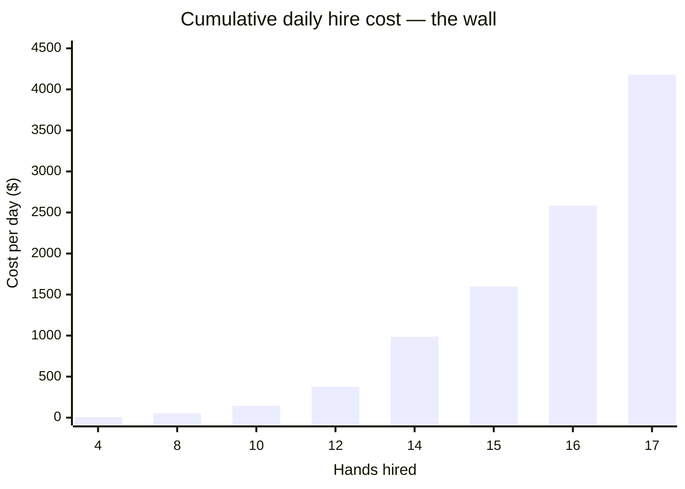
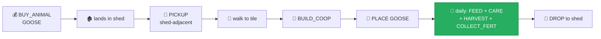

[← 08 Experiments](08-experiments.md) | **09 — Dead Ends** | [Next: Leaderboard Status →](10-leaderboard-status.md)

---

# 09 — Dead Ends


Ideas that looked strong, were investigated properly, and were **rejected before code was
written**. Documented so nobody spends days rediscovering why they don't work.

---

## 🏗️ The SE quadrant expansion

### The idea

[07 — The Diagnosis](07-diagnosis.md) says: produce more. The obvious way is more land and
more workers.

And there was a genuinely clean opening. I mapped every tile the baseline agent ever
occupies across three full seasons:

```
    ##########      # = the agent uses this tile
    ##########      . = unlocked but never used
    ##########      (blank) = never unlocked
    ##########
    ##########
    #####
    #####
    #####
    #####
    #####
```

| Finding | Value |
|---|---|
| Tiles the agent ever occupies | 75 |
| Tiles ever unlocked | 75 |
| **Never-used unlocked tiles** | **0** |
| **Quadrants never purchased** | **1 — the SE, 25 tiles, $4,000** |

The agent buys 3 of 4 quadrants and uses **every single tile** of them. But it never buys
the fourth. That is 25 tiles the scripted route **provably** never touches — a
collision-free zone where an overlay could operate with zero interference.

### The hand-indexing problem, solved

A worry: extra hired hands would shift the positional indices the recording uses for its
own hands, corrupting the whole route.

I checked the last hire time per day:

| Day | 0 | 1 | 2 | 3 | 4 | 5 | 6 | 7 | 8 | 9 | 10–29 |
|---|---|---|---|---|---|---|---|---|---|---|---|
| Last HIRE at hour | 0 | 0 | 0 | 2 | 1 | 0 | **17** | 0 | 0 | 0 | **1** |

> [!TIP]
> The recording finishes hiring by **hour 1** on nearly every day. Extra hands hired from
> hour 2 onward append to the **end** of the roster, leaving the recording's own indices
> untouched. The problem was solvable.

So: free land, solvable indexing, and a clear production need. Everything checked out
except the money.

---

## 💸 The arithmetic that killed it

Hiring cost is `fib(n)` where n is the number of hands already hired **that day**. The
baseline **already hires 10–14 hands per day**. So extra workers don't cost $1 or $2 —
they cost whatever comes next in the sequence.

| Hand # | Marginal cost |
|---|---|
| 1st–10th | $143 **total** |
| 11th | $89 |
| 12th | $144 |
| 13th | $233 |
| 14th | $377 |
| **11th–14th combined** | **$843 per day** |
| 15th | $610 |
| 16th | $987 |
| 17th | $1,597 |



### The comparison

| | |
|---|---|
| 4 extra hands × 17 remaining days | **~$14,331** |
| Land cost | **$4,000** |
| Carrot seed for 25 tiles × 4 cycles | ~$2,000 |
| **Total cost** | **~$20,300** |
| 300 carrots at marginal ~$30/unit | **~$8,500** |
| **Net** | 🔴 **−$11,800** |

> [!CAUTION]
> **The expansion loses roughly $12,000.** Not marginal — decisively negative.

### The lesson

> [!IMPORTANT]
> **Labour, not land, is the binding cost.** The Fibonacci curve means the baseline's 10–14
> hands/day is already at the economic optimum. There is no cheap labour left to buy.
>
> This is why "produce more" cannot be bolted on. It requires making the **existing** ~6,673
> actions more productive — i.e. attacking the 42.8% movement overhead — which means
> rewriting the routing, not adding an overlay.

I killed this before writing the ~150-line state machine it would have required. Checking
the arithmetic first saved hours of work on something the numbers already ruled out.

---

## 📉 Optimal sell pacing

### The idea

Spread large sales across turns so town demand refills inventory between them, keeping
prices high. The baseline dumps 22 strawberries and 54 milk in single turns late in the
season.

### Why it was rejected

Tested directly as **V17** and **V18b**:

- V17 (holding for better prices) → **−$149,090**, destroyed its own working capital
- V18b (retiming melon) → **exactly $0**, 16 of 30 games identical

More fundamentally, [07 — The Diagnosis](07-diagnosis.md) shows the agent already realises
prices *above* base on almost everything. There is no bad pricing to fix.

> [!NOTE]
> The baseline's realised average prices — milk $279/unit against a $160 base, strawberry
> $250 against $120 — are already excellent. Pacing cannot improve on selling into a
> starved market.

---

## 💩 Using fertilizer instead of selling it

### The idea

Fertilizer sells for $64 late in the season and crashes to $1 in mirror matches (both
players dumping into a market with zero regeneration). Using it on crops instead — doubling
yield bonuses — might be worth more.

### Why it wasn't pursued

Partially tested inside V18, which proved the coupling exists in the opposite direction:
selling fertilizer *starved* the 72 existing `FERTILIZE` actions and cost far more than the
sales earned.

The genuine version — **shifting the balance** from 300 sold / 72 used toward more used —
requires changing which tiles get fertilized and when. That is a route change, not a market
change, and is out of reach for a replay agent.

> [!TIP]
> **This one is still live for a rewritten agent.** In mirror matches fertilizer is nearly
> worthless to sell, so using it is close to free. Worth revisiting — see
> [12 — Roadmap](12-roadmap.md).

---

## 🐣 Bolting an egg line onto the replay

### The idea

Eggs are the single most attractive untapped product: glut-proof (logarithmic curve, still
$37/unit at +1,600), geese are the cheapest animal at $300, and the baseline sells **zero**.

### Why it wasn't pursued

The goose pipeline is long and every step needs a worker action *and* shed coordination:



`FEED` requires **wheat in the worker's inventory**, which means competing with the
recording's own wheat logistics for its 12 existing animals. Combined with the labour cost
above, there is no spare capacity to run it.

> [!TIP]
> **Also still live for a rewritten agent** — arguably the highest-value single addition.
> See [12 — Roadmap](12-roadmap.md).

---

## 🔧 Fixing the turn-0 order overflow

### The idea

Turn 0 commits ~$3,212 against $3,000, so the last orders fail. Reordering to put capital
goods first would recover the loss.

### Why it was abandoned

I tested it and **the recording already self-heals**:

| | After turn 0 | After turn 1 |
|---|---|---|
| Money | $3 | $9 |
| Melon seeds | 2 (wanted 5) | ✅ **5** |
| Wheat seeds | 3 (wanted 5) | ✅ **5** |
| Hands | 4 (wanted 5) | 4 |

Turn 1 issues `SELL WHEAT 9`, `BUY_SEED MELON 3`, `BUY_SEED WHEAT 2` — exactly restoring
the shortfall.

> [!NOTE]
> **Real loss: about one worker on day 0.** I initially reported this as a ~$2,600/game bug.
> That was wrong — see [11 — Mistakes & Corrections](11-mistakes-and-corrections.md).

---

## 📋 Summary

| Idea | Status | Reason |
|---|---|---|
| SE quadrant + extra hands | ❌ Killed | Labour costs $14k against $8.5k revenue |
| Optimal sell pacing | ❌ Killed | Tested twice; market already starved |
| Turn-0 reorder | ❌ Abandoned | Recording self-heals; loss is trivial |
| Fertilizer use vs sale | ⏸️ Deferred | Needs a route rewrite — still promising |
| Egg production line | ⏸️ Deferred | Needs a route rewrite — **highest value** |

> [!IMPORTANT]
> Notice the pattern: **everything that survives scrutiny requires rewriting the route.**
> That is the honest conclusion of this entire investigation.

---

[← 08 Experiments](08-experiments.md) | **09 — Dead Ends** | [Next: Leaderboard Status →](10-leaderboard-status.md)
