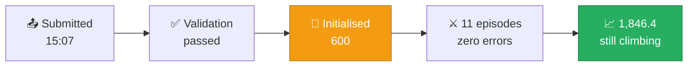
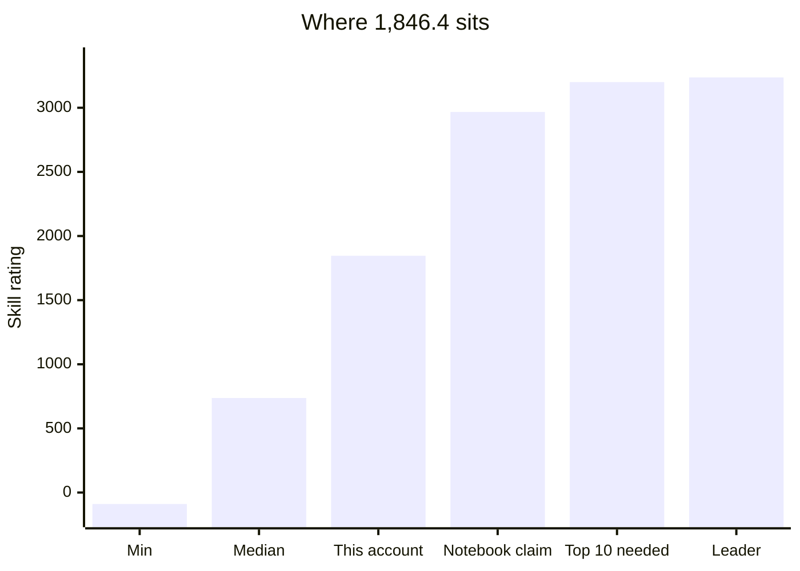

[← 09 Dead Ends](09-dead-ends.md) | **10 — Leaderboard Status** | [Next: Mistakes →](11-mistakes-and-corrections.md)

---

# 10 — Leaderboard Status


Real data pulled from the Kaggle API on **13 August 2026**.

---

## 🚨 The scare: "the score is 600"

Shortly after submitting, the score displayed as **600** — far below the 2,966.9 shown on
the source notebook. This looked like a catastrophic regression.

**It wasn't.** Two separate things were going on.

---

## ✅ Finding 1 — 600 is the starting value

From the competition's own Evaluation section:

> the submission is initialized with a **default rating** and joins the matchmaking pool

**600 is that default.** Every new submission begins there and climbs as it plays games. It
is not a score your agent earned.

By the time I pulled the data, it had already climbed:

| Metric | Value |
|---|---|
| Submission ID | `55486150` |
| File | `main.py` |
| Submitted | 2026-08-13 15:07:43 |
| Status | `COMPLETE` |
| **Score** | **1,846.4** |

### Episode history — all clean

| Episodes | Type | State |
|---|---|---|
| 1 | Validation (self-play) | ✅ COMPLETED |
| 11 | Public ladder | ✅ COMPLETED |
| **0** | — | ❌ **no errors** |

Games ran roughly every 4 minutes from 15:07 to 15:51.



> [!TIP]
> Ratings move in large steps early because uncertainty is high, then settle. 600 → 1,846
> in eleven games is completely normal convergence behaviour.

---

## 🔴 Finding 2 — the 2,966.9 was never this account's score

This is the more significant discovery.

```bash
$ kaggle competitions submissions kaggriculture

     ref  fileName  date                  status                     publicScore
--------  --------  --------------------  -------------------------  -----------
55486150  main.py   2026-08-13 15:07:43   SubmissionStatus.COMPLETE  1846.4
```

> [!CAUTION]
> **Exactly one submission exists on this account.** There is no notebook submission behind
> it and never was.

The 2,966.9 is the public score displayed on the **original author's** notebook page. The
notebook was obtained already carrying its author's number — and the notebook itself
credits its route to another competitor's public replays
(see [05 — Agent Teardown](05-agent-teardown.md#provenance)).

### What this means

| Belief | Reality |
|---|---|
| ❌ "My agent scored 2,966.9 then dropped to 600" | ✅ The account never scored 2,966.9 |
| ❌ "Something broke" | ✅ Nothing broke — one clean submission, climbing normally |
| ❌ "I lost a good submission" | ✅ Nothing was displaced; only one submission exists |

> [!IMPORTANT]
> There was never a 2,966.9 to lose. The agent did not get worse. See
> [11 — Mistakes & Corrections](11-mistakes-and-corrections.md) for how I contributed to
> this confusion by not verifying it at the start.

---

## 📊 Where this sits in the field

| Metric | Value |
|---|---|
| Teams on leaderboard | **4,283** |
| This account ("Amer") | **rank 920** |
| Score | 1,846.4 |
| Median score | 736.9 |
| Top score | 3,236.5 |
| Lowest score | −89.6 |
| Teams above 3,000 | **28** |



### Rank projections

| If score were… | Approximate rank |
|---|---|
| 736.9 (median) | ~2,140 |
| **1,846.4 (current)** | **920** |
| 2,966.9 (notebook's claim) | **~39** |
| ~3,200 | ~10 |

> [!WARNING]
> **Even at full convergence to 2,966.9, this agent lands around rank 39 — well outside the
> money.** Top 10 pays $5,000 each and requires roughly 3,200. Twenty-eight teams are packed
> between 3,000 and 3,236.
>
> Incremental patching will not close that gap; four measured experiments demonstrated as
> much. See [12 — Roadmap](12-roadmap.md).

---

## 📋 Submission management rules

> [!CAUTION]
> **Only your latest 2 submissions are tracked** and used for final leaderboard evaluation.
> Older ones stop playing entirely.

| Rule | Consequence |
|---|---|
| Up to 5 submissions/day | Plenty of budget |
| Only latest 2 tracked | ⚠️ Careless submitting evicts good agents |
| Only best bot shown on leaderboard | Your displayed score may come from either tracked bot |
| New submissions start at 600 | Every submission pays a fresh convergence cost |
| Games run until ~15 Oct | Late submissions have less time to converge |

### Practical guidance

```diff
+ DO submit when you have something genuinely different to test
+ DO submit good agents early so they have time to converge
- DON'T re-submit an identical agent — it restarts at 600 for zero benefit
- DON'T submit casually near the deadline — convergence time is finite
```

> [!TIP]
> **Current recommendation: don't submit anything.** The live bot is mid-convergence with a
> clean record. A new submission would restart at 600 and consume a tracked slot with
> nothing new to measure.

---

## 🔧 Commands used

```bash
kaggle competitions submissions kaggriculture      # submission list + scores
kaggle competitions episodes 55486150              # per-episode history
kaggle competitions leaderboard kaggriculture -s   # top of leaderboard
kaggle competitions leaderboard kaggriculture -d   # full leaderboard CSV
kaggle competitions logs <EPISODE_ID> 0            # agent logs (debugging)
kaggle competitions replay <EPISODE_ID>            # replay JSON
```

Authentication is via `kaggle auth login` (browser OAuth) or a token file at
`~/.kaggle/access_token`.

---

[← 09 Dead Ends](09-dead-ends.md) | **10 — Leaderboard Status** | [Next: Mistakes →](11-mistakes-and-corrections.md)
