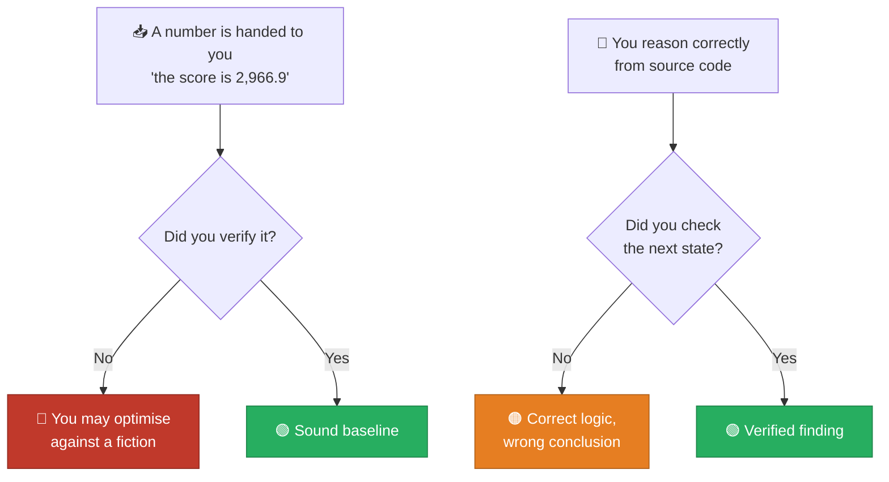

[← 10 Leaderboard Status](10-leaderboard-status.md) | **11 — Mistakes & Corrections** | [Next: Roadmap →](12-roadmap.md)

---

# 11 — Mistakes & Corrections


An honest record of what I got wrong during this work, how each was caught, and what it
cost. Included because these errors affect how you should read everything else.

---

## 🔴 Mistake 1 — Optimising against a number I never verified

### What happened

The task was framed as *"optimise the score 2,961.7 / 2,966.9"*. I accepted that number at
face value and built the **entire investigation** around beating it — the price model, the
diagnosis, four experiments, days of analysis.

### What was actually true

The account has **exactly one submission**, made during this session. The 2,966.9 belongs
to the **original author's** notebook page. It was never this account's score.

### How it was caught

Only after the "score is 600" scare, when I finally ran:

```bash
kaggle competitions submissions kaggriculture
```

One row came back. That single command settled it in about two seconds.

### Severity

| | |
|---|---|
| Impact on the analysis | 🟢 **None** — the economics and experiments stand on their own |
| Impact on framing | 🔴 **Significant** — "improve on 2,966.9" was the wrong goal all along |
| Cost | Wasted framing, and unnecessary alarm when 600 appeared |

> [!CAUTION]
> **The lesson: verify the baseline before optimising against it.** I should have run that
> command in the first five minutes. Establishing where you actually stand is step zero of
> any optimisation task, and I skipped it because the number was handed to me confidently.

---

## 🟠 Mistake 2 — Overstating the turn-0 bug

### What I claimed

I found that turn 0 commits ~$3,212 against $3,000 of starting money, so later orders fail.
I read the engine source, confirmed that a failed unit aborts the whole order
(`_commit_unit` → `order_states[player_id] = None`), measured the post-turn-0 state, and
reported:

> "3 melon seeds, 2 wheat seeds, and 1 hand lost, every game" — worth ~$2,600/game

I listed it as the **top-priority fix**.

### What was actually true

The recording **self-heals on turn 1**:

```
turn 1 market: SELL WHEAT 9, BUY_SEED MELON 3, BUY_SEED WHEAT 2
```

| | After turn 0 | After turn 1 |
|---|---|---|
| Melon seeds | 2 | ✅ **5** (intended) |
| Wheat seeds | 3 | ✅ **5** (intended) |
| Hands | 4 | 4 (one genuinely lost) |

**Real loss: about one worker on day 0.** Nearly nothing.

### How it was caught

By stepping the environment forward one more turn and printing the state — something I
should have done before reporting.

### Severity

| | |
|---|---|
| Impact on the analysis | 🟢 None — this was a side finding |
| Impact on prioritisation | 🟠 Moderate — I named it the #1 fix when it was negligible |

> [!WARNING]
> **The lesson: correct reasoning from source is not the same as verification.** My
> reasoning about the engine was accurate. My conclusion was wrong because I stopped
> looking one turn too early. In a system with recovery logic, you must check whether
> recovery happens.

---

## 🟡 Mistake 3 — Breaking the Python environment

### What happened

```bash
pip install -U kaggle-environments
```

This upgraded **numpy to 2.5.2**, which broke existing packages:

```diff
- tensorflow-intel 2.18.0 requires numpy<2.1.0,>=1.26.0  → INCOMPATIBLE
- ultralytics 8.3.82     requires numpy<=2.1.1,>=1.23.0  → INCOMPATIBLE
- thinc 8.2.5            requires numpy<2.0.0            → INCOMPATIBLE
```

### Status

🔴 **Still unresolved.** Your base conda environment currently has broken TensorFlow,
Ultralytics, and spaCy/thinc installs.

### The fix

Either pin numpy back:

```bash
pip install "numpy<2.1"
```

…or, better, isolate this project:

```bash
python -m venv .venv
.venv/Scripts/activate
pip install -U kaggle-environments kaggle
```

> [!CAUTION]
> **The lesson: install into an isolated environment by default when adding dependencies to
> someone else's machine.** I installed into the base conda environment without checking
> what depended on numpy. A virtualenv costs ten seconds and avoids the problem entirely.

---

## ✅ What I got right

For balance, the process decisions that worked:

| Decision | Why it mattered |
|---|---|
| **Verified the price model against the official table** | All 27 reference values matched; everything downstream is trustworthy |
| **Tested both seat orders** | Seat 0 has a $1,006 advantage — single-seat testing would have produced false positives |
| **Used 15 seeds per comparison** | Shop-draw variance is ±47%; fewer seeds would prove nothing |
| **Ran V18b as a control** | Isolated fertilizer coupling as the sole cause of V18's loss |
| **Diagnosed failures instead of just recording them** | Every failure has an identified mechanical cause, which is where the real findings came from |
| **Killed the SE expansion with arithmetic first** | Saved hours building something the numbers already ruled out |
| **Reported four failures honestly** | No improvement was ever claimed that wasn't measured |

---

## 🧭 The meta-lesson



> [!IMPORTANT]
> Both of the substantive mistakes came from the same failure mode: **trusting a
> plausible-looking claim instead of running the cheap check that would settle it.** In
> both cases the check took seconds and was available from the start.

---

## 📌 Corrections applied to these documents

Everything in this documentation set reflects the corrected understanding:

| Correction | Where reflected |
|---|---|
| 2,966.9 was not this account's score | [10 — Leaderboard Status](10-leaderboard-status.md) |
| Turn-0 bug is negligible | [05 — Agent Teardown](05-agent-teardown.md), [09 — Dead Ends](09-dead-ends.md) |
| numpy breakage outstanding | [13 — Reproducing](13-reproduce.md) |
| Agent provenance is not original | [05 — Agent Teardown](05-agent-teardown.md), repo README |
| No improvement was found | Everywhere — no variant is presented as a success |

---

[← 10 Leaderboard Status](10-leaderboard-status.md) | **11 — Mistakes & Corrections** | [Next: Roadmap →](12-roadmap.md)
