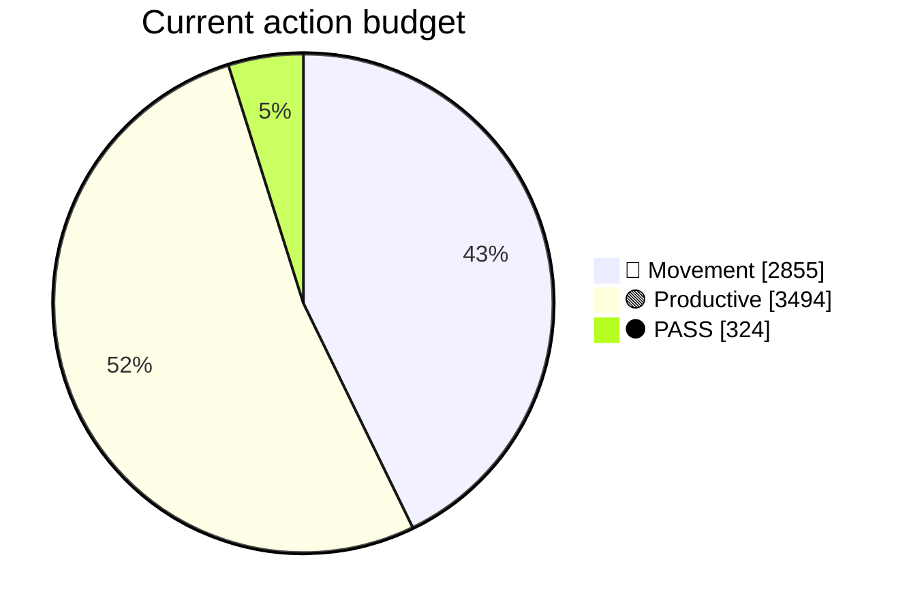
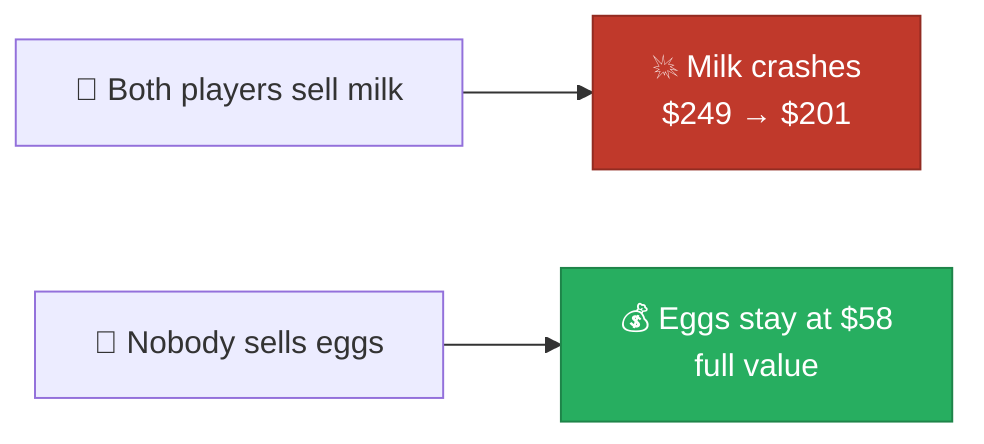
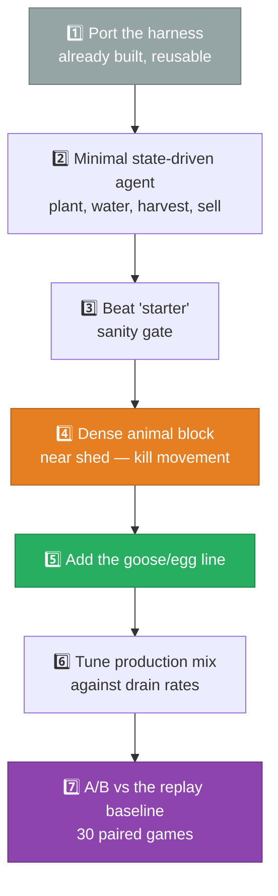

[← 11 Mistakes](11-mistakes-and-corrections.md) | **12 — Roadmap** | [Next: Reproducing →](13-reproduce.md)

---

# 12 — Roadmap


What would actually climb the leaderboard, derived from everything measured.

---

## 🎯 The gap

| | Rating | Rank |
|---|---|---|
| Current (converging) | 1,846.4 | 920 / 4,283 |
| This agent fully converged (est.) | ~2,900–3,000 | ~30–40 |
| **Top 10 (the money)** | **~3,200** | **10** |

> [!WARNING]
> **Even at full convergence this agent falls short.** Twenty-eight teams sit between 3,000
> and 3,236. Four measured experiments established that patching cannot close the gap — see
> [08 — Experiments](08-experiments.md).

---

## ⛔ What is ruled out

```diff
- ❌ Reserve prices / holding stock          tested: V17, -$149,090
- ❌ Sell timing and pacing                  tested: V18b, exactly $0
- ❌ Dumping no-regeneration goods early     tested: V18, -$18,402
- ❌ Salvaging wasted actions                tested: V19, -$68
- ❌ Buying the 4th quadrant + extra hands   killed by arithmetic: -$11,800
- ❌ Any market-only change whatsoever       structurally blocked by shed coupling
```

> [!IMPORTANT]
> **The market layer and the unit route are coupled through the shed.** `PICKUP`, `FEED`,
> and `FERTILIZE` all read shed contents, so changing what you sell silently breaks what
> your workers can do. This eliminates the entire cheap half of the search space.

---

## ✅ What remains: a state-driven agent

The only path forward is replacing the open-loop replay with an agent that decides each
turn from actual board state. Two targets, both quantified.

### 🎯 Target 1 — Kill the movement overhead

**42.8% of all actions are walking.** 2,855 of 6,673.



The mechanism that fixes this is already in the rules:

| Layout | Actions per worker-visit | Movement cost |
|---|---|---|
| 🌾 **Crop tile** | 1 (`WATER`) | 🔴 a move per tile, every day |
| 🐄 **Animal tile** | **4** (`FEED`, `CARE`, `HARVEST`, `COLLECT_FERTILIZER`) | 🟢 **zero** |

> [!TIP]
> **A worker standing on one occupied pasture performs four productive actions without
> moving.** Crops require a move per watering. Shifting the production mix toward a dense
> animal block adjacent to the shed converts walking directly into output.

Workers respawn at the shed each day, so tiles near the centre are structurally cheaper.
Every tile of distance costs two actions per day (out and back, amortised).

**Estimated value:** moving from 43% to 25% movement frees ~1,200 actions. At the
$33–51/action rates computed for animal work, that is **$40,000–60,000** — though the real
figure depends on what the market can absorb.

---

### 🎯 Target 2 — Open the untapped demand

The current agent sells **zero** eggs, carrots, and tomatoes. Together those represent
~780 units/season of continuously replenishing demand.

| Product | Sold now | Town drain/season | Marginal $/unit at +240 | Glut behaviour |
|---|---|---|---|---|
| 🥚 **Egg** | **0** | 228 | **$45** | 🟢 **uncrashable** (log) |
| 🍅 **Tomato** | **0** | 228 | **$48** | 🟢 robust (crashes at +529) |
| 🥕 **Carrot** | **0** | 327 | **$30** | 🟢 robust (crashes at +842) |

> [!IMPORTANT]
> **Eggs are the standout.** Geese are the cheapest animal ($300), produce daily (the
> fastest cycle in the game), and egg price is essentially uncrashable — still $37/unit at
> a glut of 1,600. Selling 1,000 eggs returns **$39,799**, more than any premium product at
> any volume.
>
> And they compound with Target 1: geese are animals, so they are zero-movement production.

### Why this matters most in mirror matches

Against a passive opponent the baseline makes $181,057. Against a copy of itself, only
~$124,000 — because both players crash the same markets. But an opponent flooding milk and
strawberry leaves **eggs, carrots, and tomatoes completely untouched**, still at full price.



Diversifying into ignored products is **the single best defence against mirror matches**,
which are exactly the matches you must win to climb.

---

## 🏗️ Suggested build order



| Step | Deliverable | Gate |
|---|---|---|
| 1 | Reuse `analysis/harness.py` | — |
| 2 | Agent that perceives state and acts | Doesn't crash in self-play |
| 3 | Sanity check | Beats `starter` (baseline does 131,869 vs 3,504) |
| 4 | Compact animal-first layout | Movement share below 30% |
| 5 | Goose/egg production | Sells >200 eggs/season |
| 6 | Mix tuned to town drain rates | No product ends below base price |
| 7 | Head-to-head validation | **Beats the replay over 30 paired games** |

> [!TIP]
> **Step 7 is the only step that counts.** Everything else is intermediate. The replay
> baseline is a legitimate and demanding opponent — beating it over 30 paired games is a
> real result.

---

## 📐 Design constraints to respect

Hard-won from the experiments — violating any of these has already been shown to fail:

| Constraint | Evidence |
|---|---|
| 🔴 **Early cash is fragile** — days 0–9 run on $9–$1,000 | V17 flatlined at $0 by day 6 |
| 🔴 **Shed caps at 100; overflow is destroyed** | V19 gained nothing; shed already at 100 by day 18 |
| 🔴 **`FEED`/`FERTILIZE` draw from worker inventory** | V18 no-oped 72 fertilize actions |
| 🔴 **Market orders execute in order, stop when broke** | Turn-0 overflow, engine line 660 |
| 🔴 **Hiring beyond ~14/day is unaffordable** | Hands 11–14 cost $843/day |
| 🟠 **Animals starve in 2 unfed days — permanent loss** | Rules; a lost cow is $400 plus all future output |
| 🟠 **Shop draw creates ±47% revenue variance** | Measured across 6 draws |

---

## 📊 Production targets

From [04 — Town Demand](04-town-demand.md), the sustainable daily sales rate at 8 shops:

| Product | Units/day | Revenue/day at base | Priority |
|---|---|---|---|
| 🍓 Strawberry | 25 | $3,000 | 🟡 already saturated by baseline |
| 🥛 Milk | 19 | $3,040 | 🟡 near limit at 8 cows |
| 🧶 Wool | 13 | $2,600 | 🟢 room for more |
| 🌾 Wheat | 31 | $775 | ⚪ also animal feed |
| 🍅 Tomato | 13 | $780 | 🟢 **completely untapped** |
| 🥚 Egg | 13 | $650 | 🟢 **completely untapped, uncrashable** |
| 🥕 Carrot | 19 | $665 | 🟢 **completely untapped** |

> [!NOTE]
> **Sell at or below the drain rate and the price never falls.** These numbers are direct
> production targets — something no amount of selling logic can substitute for.

---

## ⏱️ Effort estimate

| Task | Scale |
|---|---|
| Minimal state-driven agent | ~300–500 lines |
| Movement-efficient layout planner | ~150 lines |
| Animal lifecycle management | ~150 lines |
| Market sizing against drain rates | ~100 lines |
| Tuning and A/B iteration | the bulk of the time |

**Realistically a multi-day build**, not a patch. That is the honest assessment — and it is
why four attempts at shortcuts all failed.

> [!IMPORTANT]
> **The deadline is 30 September 2026.** There is time. But note that agents need weeks of
> ladder play to converge, so a strong agent submitted in early September will finish higher
> than the same agent submitted on the 29th.

---

[← 11 Mistakes](11-mistakes-and-corrections.md) | **12 — Roadmap** | [Next: Reproducing →](13-reproduce.md)
