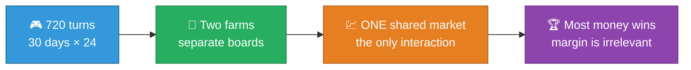
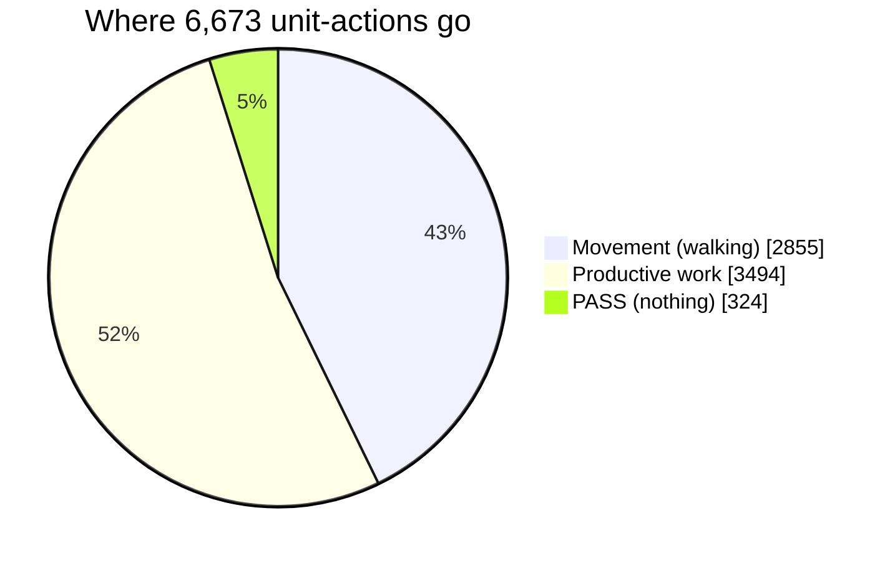

# 🌾 Kaggriculture — Complete Documentation


Complete documentation of the Kaggriculture investigation: the game's economics derived
from scratch and verified, the existing agent taken apart, four experiments measured
against the real engine, and an honest account of what worked, what didn't, and why.

**Written for a reader with zero prior context.** Start at
[01 — Competition Overview](01-competition-overview.md) and read in order, or jump to
whatever you need below.

---

## 🎯 The one-sentence result

> [!IMPORTANT]
> **Strong agents in this competition are supply-constrained, not price-constrained.**
> Seven of the nine products finish a season trading *above* base price — the market is
> starving for goods. Every attempt to sell more cleverly failed, and the failures
> pinpoint exactly where the remaining opportunity is.

---

## 📚 Documentation index

### Part I — Background

| # | Document | What it covers |
|---|---|---|
| 01 | [Competition Overview](01-competition-overview.md) | What this competition is, timeline, prizes, and how the skill-rating system actually works |
| 02 | [Game Rules Reference](02-game-rules.md) | Complete mechanics: board, workers, crops, animals, actions, turn order |
| 03 | [Market Economics](03-market-economics.md) | The price formula derived, verified, and plotted — the analytical core |
| 04 | [Town Demand & Flow](04-town-demand.md) | Why the market is a *flow* system and what that changes |

### Part II — Investigation

| # | Document | What it covers |
|---|---|---|
| 05 | [Agent Teardown](05-agent-teardown.md) | Decoding V16-RC5: it's a hardcoded 720-turn replay. Full profile |
| 06 | [Methodology](06-methodology.md) | The test harness, seat advantage, and how to measure fairly |
| 07 | [The Diagnosis](07-diagnosis.md) | The end-of-season evidence that settles the question |

### Part III — Results

| # | Document | What it covers |
|---|---|---|
| 08 | [Experiments](08-experiments.md) | All four variants: hypothesis, result, and mechanical cause of failure |
| 09 | [Dead Ends](09-dead-ends.md) | Ideas killed by arithmetic before code was written |
| 10 | [Leaderboard Status](10-leaderboard-status.md) | Real standing, submission data, what "600" meant |

### Part IV — Reference

| # | Document | What it covers |
|---|---|---|
| 11 | [Mistakes & Corrections](11-mistakes-and-corrections.md) | Errors I made and how they were caught |
| 12 | [Roadmap](12-roadmap.md) | What would actually climb the leaderboard |
| 13 | [Reproducing This Work](13-reproduce.md) | Commands to rerun every number here |
| 14 | [Glossary](14-glossary.md) | Every term used, defined |

---

## ⚡ Fast facts



| Fact | Value |
|---|---|
| Season length | 720 turns (30 days × 24) |
| Starting money | $3,000 |
| Board | 10×10, four 5×5 quadrants (you start with one) |
| Extra quadrants | $1,000 / $2,000 / $4,000 |
| Shed capacity | **100 items — overflow is destroyed** |
| Hiring cost | Fibonacci: 1, 1, 2, 3, 5, 8, 13, 21, 34, 55, 89, 144… |
| Market starting inventory | 10,000 units per product |
| Win condition | Most coins at turn 720 |

---

## 📊 Headline numbers

### The diagnosis — 7 of 9 products end above base price

| Product | End price | vs base | State |
|---|---|---|---|
| 🍓 Strawberry | $229 | **191%** | 🟢 starved |
| 🌾 Wheat | $40 | **160%** | 🟢 starved |
| 🥛 Milk | $249 | **156%** | 🟢 starved |
| 🍅 Tomato | $78 | **130%** | 🟢 starved |
| 🥕 Carrot | $42 | **120%** | 🟢 starved |
| 🧶 Wool | $240 | **120%** | 🟢 starved |
| 🥚 Egg | $58 | **116%** | 🟢 starved |
| 🍈 Melon | $194 | 78% | 🔴 oversupplied |
| 💩 Fertilizer | $64 | 64% | 🔴 oversupplied |

### The experiments — all four failed

```diff
- V17   Adaptive reserve-price seller        0-0-24     -$149,090
- V18   Sell melon + fertilizer on sight     2-0-28      -$18,402
  V18b  Sell melon only                      7-16-7            $0
- V19   Salvage provable no-op actions       9-0-21          -$68
```

### The action budget — 43% of effort is walking



---

## 🧭 Reading paths

**"I know nothing, explain everything"**
→ 01 → 02 → 03 → 04 → 05 → 06 → 07 → 08 → 09 → 10 → 11 → 12

**"I just want to know what you found"**
→ [07 Diagnosis](07-diagnosis.md) → [08 Experiments](08-experiments.md) → [12 Roadmap](12-roadmap.md)

**"I want to build a better agent"**
→ [03 Market Economics](03-market-economics.md) → [04 Town Demand](04-town-demand.md) → [12 Roadmap](12-roadmap.md) → [13 Reproduce](13-reproduce.md)

**"Did anything go wrong?"**
→ [11 Mistakes & Corrections](11-mistakes-and-corrections.md)

---

## ⚠️ Two standing warnings

> [!WARNING]
> **The submitted agent is not original work.** It is an open-loop replay obtained from a
> published community notebook, which itself reconstructs its route from another
> competitor's public replays. See [05 — Agent Teardown](05-agent-teardown.md#provenance)
> before publishing anything under your name.

> [!CAUTION]
> **Your environment has an unresolved breakage.** Installing `kaggle-environments`
> upgraded numpy to 2.5.2, which breaks `tensorflow-intel 2.18`, `ultralytics`, and
> `thinc`. See [13 — Reproducing](13-reproduce.md#environment-warning) for the fix.

---

## 🗂️ Related files outside this folder

| Path | What it is |
|---|---|
| `../PROJECT_WALKTHROUGH.md` | Single-file narrative version of these docs |
| `../kaggriculture-analysis/` | The git repo: agent, notebook, harness, variants |
| `../kaggriculture-analysis/notebook/` | Publishable Kaggle notebook |
| `../README.md`, `../AGENTS.md` | The competition's own official documentation |
